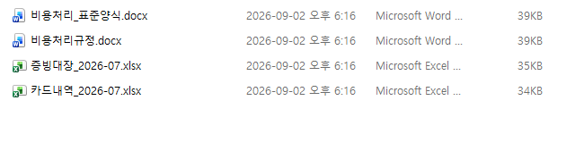
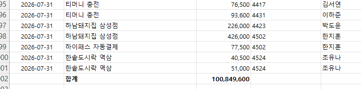
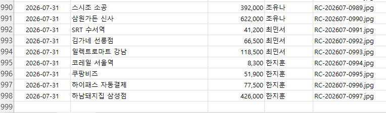
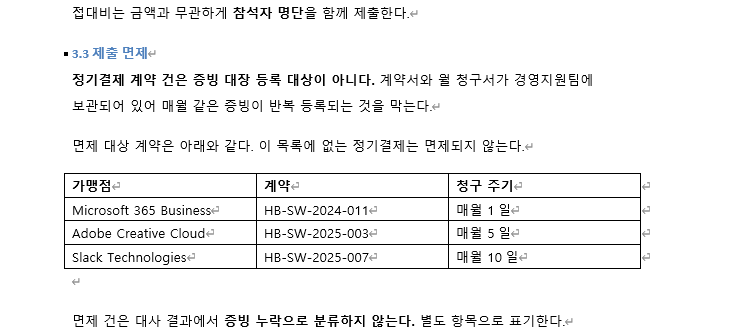
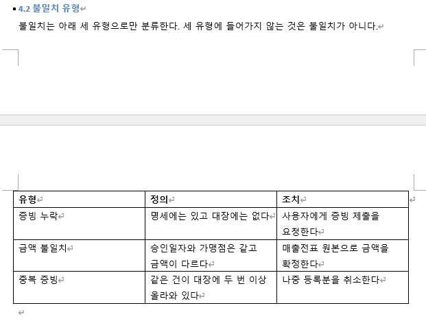
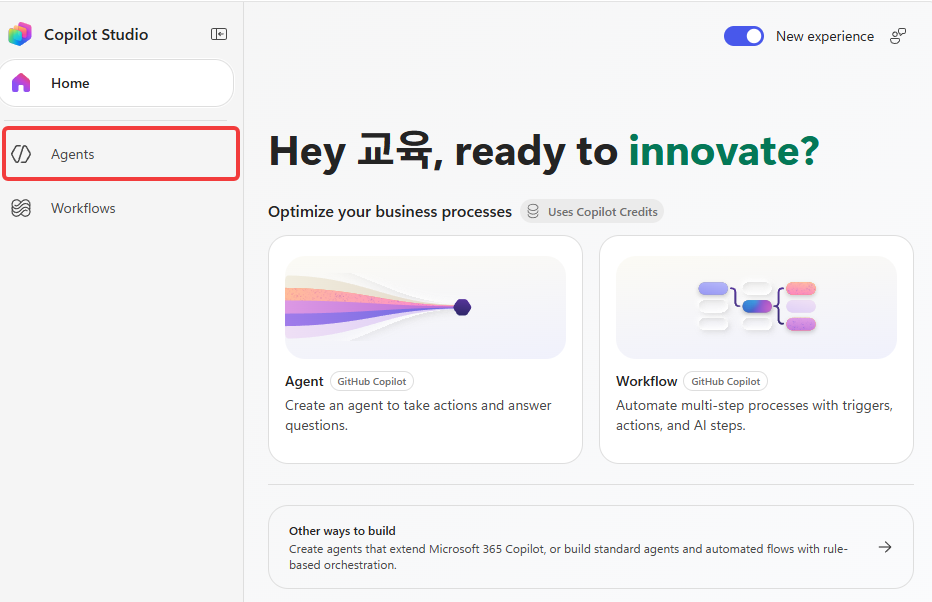
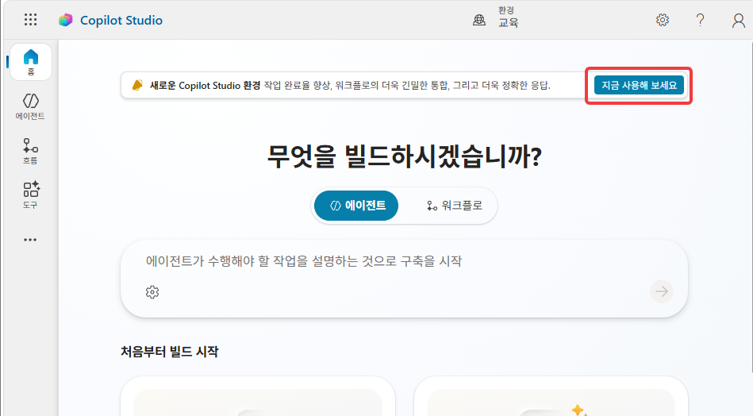
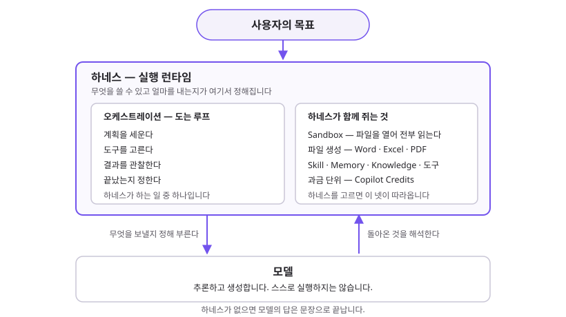
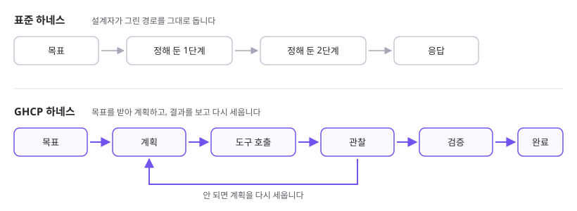

# 시작 전에 ✅

> **이번 시간 완성물**: 환경을 확인하고, 사전 제공 파일을 준비한 상태  
> **예상 시간**: 10분  
> **완성 신호**: 재료 파일을 열어 행 수를 확인했다

{: .time }
10분 타이머.

---

## 오늘 만들 것

한별소프트 경리팀의 월말 업무입니다. 카드사에서 내려받은 **명세 1,000행**과 직원들이 올린 **증빙 대장 997행**을 대조합니다.

어긋난 데이터를 찾아 목록으로 만들고, 일치하는 것은 처리 문서로 넘깁니다.

---

## 재료

네 개를 다운로드해 한 폴더에 저장합니다. 

| 파일 | 무엇 |
|---|---|
| [카드내역_2026-07.xlsx](../materials/카드내역_2026-07.xlsx) | 법인카드 명세 1,000행 + 하단 합계 |
| [증빙대장_2026-07.xlsx](../materials/증빙대장_2026-07.xlsx) | 증빙 대장 997행 |
| [비용처리규정.docx](../materials/비용처리규정.docx) | Knowledge로 올릴 처리 기준 |
| [비용처리_표준양식.docx](../materials/비용처리_표준양식.docx) | Skill이 쓸 회사 표준 템플릿 |

<!-- 저작 메모: csv 판(카드내역_2026-07.csv · 증빙대장_2026-07.csv)도 materials/ 에 있다.
     GHCP 하네스의 대화 첨부 지원 형식에 xlsx 가 없다(이미지·PDF·txt/csv/html/md·URL).
     프로브 1에서 xlsx 첨부가 막히면 이 표를 csv 로 갈아 끼운다. 링크만 바꾸면 된다.
     https://learn.microsoft.com/microsoft-copilot-studio/agents-experience/attachments-overview
     2026-09-08: /tone 검수 — 「자리」·의인화·대구를 걷어냈다.
                 검출은 ~/.claude/skills/tone/dialect.py 가 한다.
     2026-09-08: /tone 전문 검수 — 말투(비유·구어·의인화) 외에 띄어쓰기 오류와
                 비문, 절 제목 종결형 불일치를 함께 고쳤다. dialect.py 0건.
     -->

## 지식 원본을 어떻게 등록하나

{: .warning }
**환경에 따라 파일을 직접 올리지 않습니다.** 재료를 Agent에 업로드하는 대신, SharePoint에 올려 둔 같은 파일을 지식 원본으로 등록합니다. 

파일을 업로드해 Knowledge로 쓰면 그 파일은 **Dataverse에 저장되고 거기서 색인됩니다.** 환경의 Dataverse 권한과 Dataverse 검색 설정이 함께 필요하고, 둘 중 하나가 없으면 업로드 단계에서 멈춥니다.

| | 파일 업로드 | SharePoint 등록 |
|---|---|---|
| 파일이 놓이는 곳 | Dataverse | SharePoint 그대로 |
| 필요한 권한 | Dataverse 권한 · Dataverse 검색 | 해당 사이트 **읽기** |
| 저장소 소모 | 있다 | 없다 |
| 파일을 고치면 | 다시 올린다 | 원본을 고치면 따라간다 |

SharePoint로 가는 환경이면 재료를 다운로드해 다시 업로드하지 않습니다. **안내받은 주소를 그대로 지식 원본으로 등록합니다.**

지식 원본을 고르는 화면에서 **파일 업로드 영역 안에 있는 SharePoint** 는 이 안내가 말하는 쪽이 아닙니다. 그쪽은 SharePoint에서 고른 파일을 Dataverse로 복사하므로 업로드와 같은 권한이 필요합니다. 목록에서 원본 종류로 올라와 있는 SharePoint를 고르고, 주소를 넣습니다.

SharePoint 원본은 **보는 사람의 권한으로 읽습니다.** 안내받은 사이트에 읽기 권한이 없으면 Agent가 접근할 수 없습니다.

<!-- 저작 메모: 이 절은 재료를 Knowledge로 올리는 경로(Lab 1의 6번, 비용처리규정.docx)에 걸린다.
     대화 첨부(Lab 1의 8번, 명세·대장 xlsx)는 다른 경로이므로 여기서 다루지 않는다.
     ⚠️ SharePoint 주소를 본문에 적지 않는다(2026-09-02 결정). 테넌트 주소가 교안에 박히면
        환경이 바뀔 때마다 본문을 고쳐야 하고, 배포본에 사내 주소가 남는다. 강사가 당일 안내한다.
        _config.yml 의 sp.knowledge · sp.template · sp.sample 은 이제 본문에서 부르지 않는다 —
        강사용 메모로만 남아 있다.
     ★ 「파일 업로드 영역 안의 SharePoint」 두 갈래는 표준 하네스 문서에서 확인한 것이다.
       GHCP 하네스의 Add knowledge 대화상자에서 이 두 항목이 어떻게 보이는지는 프로브로 확인한다.
     https://learn.microsoft.com/microsoft-copilot-studio/knowledge-add-file-upload
     https://learn.microsoft.com/microsoft-copilot-studio/knowledge-add-sharepoint
     https://learn.microsoft.com/microsoft-copilot-studio/knowledge-unstructured-data#faq
     https://learn.microsoft.com/microsoft-copilot-studio/agents-experience/knowledge-add-existing-copilot -->

---

## 단계

1. 위 표의 파일 네 개를 내려받습니다. 브라우저 기본 다운로드 폴더에 그대로 두어도 됩니다.

    

2. `카드내역_2026-07.xlsx` 를 엽니다. 맨 아래로 내려가 **합계** 행의 숫자를 확인합니다. `100,849,600` 이 보입니다.

    

    {: .important }
    이 숫자를 적어 둡니다. Lab 1에서 **Agent가 전체를 읽었는지** 판정하는 기준입니다.

3. `증빙대장_2026-07.xlsx` 를 엽니다. 마지막 행 번호가 `998` 입니다. 머리글 1행에 데이터 997행입니다.

    

4. `비용처리규정.docx` 를 엽니다. **§3.3 제출 면제** 를 훑어봅니다. 면제 대상 계약 세 건이 표로 적혀 있습니다.

    

5. 이어서 **§4.2 불일치 유형** 을 봅니다. 증빙 누락 · 금액 불일치 · 중복 증빙 셋입니다. 오늘 Agent가 이 두 조항으로 판단합니다.

    

6. Copilot Studio를 엽니다. 왼쪽 메뉴에 **Agents** 가 보이면 새 환경입니다.

    

7. **무엇을 빌드하시겠습니까?** 가 보이면 이전 환경입니다. 상단 배너의 **지금 사용해 보세요** 를 눌러 새 환경으로 넘어갑니다.

    

    {: .warning }
    **이전 환경에서는 오늘 만들 것이 나오지 않습니다.** 6번 화면을 보고 시작합니다.

<!-- 미확정 — 프로브 뒤에 채운다
8. 하네스 선택 화면에서 **GitHub Copilot 하네스**를 고릅니다.
   → 환경에 따라 이 선택이 노출되지 않을 수 있다. 환경 체크리스트(설계 문서 §10)와 함께 확정한다. -->

---

## GHCP 하네스가 무엇인가

Copilot Studio에서 만드는 것은 전부 **하네스** 위에서 실행됩니다. 하네스는 모델과 내가 만든 것 사이에 있는 런타임입니다. 언제 모델을 부를지, 무엇을 보낼지, 돌아온 것을 어떻게 해석해 어느 도구를 부를지를 정합니다.

| | 무엇을 하나 |
|---|---|
| 모델 | 추론하고 생성한다. 스스로 실행하지 않는다 |
| 하네스 | 실행 런타임. 오케스트레이션 · Sandbox · 파일 생성 · 부품 · 과금이 여기에 포함된다 |
| 오케스트레이션 | 하네스 안에서 도는 루프. 계획 · 도구 선택 · 관찰 · 완료 판단 |

{: .note }
**오케스트레이션은 하네스가 하는 일 중 하나입니다.** 둘을 같은 말로 쓰는 문서도 있지만, Copilot Studio 쪽은 구분해 씁니다. GHCP 하네스는 「향상된 오케스트레이션 런타임 **위에** 서 있다」고 적히고, 표준 하네스는 「오케스트레이션 동작을 **고를 수 있다**」고 설명합니다([GitHub Copilot Harness overview](https://learn.microsoft.com/microsoft-copilot-studio/agents-experience/overview)). 하네스를 고르는 것이 먼저이고, 그 안에서 루프가 정해집니다.

<!-- 저작 메모(2026-09-02): 「Model ↔ Orchestrator ↔ Harness 3계층」 도식을 쓰지 않는다.
     오케스트레이터를 하네스 위 별도 층으로 두면, 그 층이 계획할 때도 모델이 필요하므로
     의존이 순환한다. 오케스트레이션은 하네스 안의 루프다.
     ⚠️ 한때 「오케스트레이터 = 하네스의 다른 이름」으로 적었다가 되돌렸다(같은 날).
        근거로 삼은 agents/architecture/host-platform 의 "The orchestrator, or harness" 는
        에이전트 아키텍처 일반을 다루는 글의 느슨한 동격이다. Copilot Studio 문서 셋은 갈라 쓴다 —
        agents-experience/overview(built on / configurable), guidance/generative-orchestration(planner). -->

### 하네스를 가르는 것 — 런타임 루프

무엇을 부품으로 쓸 수 있고 얼마를 내는지는 [홈의 비교표](../#무엇이-갈리나)에 있습니다. 실제로 구분되는 것은 **그 런타임 루프가 어떤 방식으로 수행되는가**입니다.

표준 하네스는 설계자가 그린 경로를 그대로 돕니다. GHCP 하네스는 목표를 받아 계획하고, 도구를 부르고, 결과를 보고, 안 되면 계획을 다시 세웁니다. **모델이 달라진 것이 아니라 루프가 달라진 것입니다.**

오늘 쓰는 것이 뒤쪽입니다. Word·Excel·PowerPoint·PDF를 만들고, [Skill](./glossary.html#skill)·[Memory](./glossary.html#memory)를 쓰며, 과금은 [Copilot Credits](./glossary.html#copilot-credits)입니다.

{: .important }
**GHCP 하네스에는 토픽이 없습니다.** 사용자의 질문을 미리 토픽으로 분기시키지 않습니다. Agent가 입력과 자료를 보고 무슨 일인지 판단합니다. 초급 및 중급 과정(Copilot Studio 표준 하네스)과 구분되는 점입니다.

---

## 확인

- [ ] 재료 파일 네 개를 내려받았다
- [ ] 명세 하단 합계 `100,849,600` 을 적어 두었다
- [ ] 증빙 대장이 997행인 것을 확인했다
- [ ] 규정 §3.3과 §4.2를 훑어봤다
- [ ] Copilot Studio 새 환경(왼쪽 메뉴 **Agents**)에 들어와 있다

---

## 출처

이 페이지의 하네스·지식 원본 설명은 Microsoft Learn 문서를 근거로 합니다. **2026-09-02 확인.**

- [Harnesses in Copilot Studio](https://learn.microsoft.com/microsoft-copilot-studio/harnesses-overview) (하네스가 셋인 것과 그 차이)
- [Agents powered by the GitHub Copilot Harness overview](https://learn.microsoft.com/microsoft-copilot-studio/agents-experience/overview) (GHCP 하네스가 오케스트레이션 런타임 위에 선다는 것)
- [Apply generative orchestration capabilities](https://learn.microsoft.com/microsoft-copilot-studio/guidance/generative-orchestration) (표준 하네스를 planner 로 놓는 구성도)
- [Choice of agent host](https://learn.microsoft.com/agents/architecture/host-platform) (오케스트레이터와 하네스를 붙여 쓴 문서. 위 둘과 다르게 읽힙니다)
- [Add file upload](https://learn.microsoft.com/microsoft-copilot-studio/knowledge-add-file-upload) · [Add SharePoint](https://learn.microsoft.com/microsoft-copilot-studio/knowledge-add-sharepoint) (지식 원본 두 경로의 차이)
- [Attachments overview](https://learn.microsoft.com/microsoft-copilot-studio/agents-experience/attachments-overview) (대화 첨부가 받는 형식)

{: .note }
Copilot Studio는 자주 바뀝니다. 화면이 이 문서와 다르면 위 문서를 먼저 봅니다.

---

[Lab 1로 →](./lab1.html){: .btn .btn-purple }
