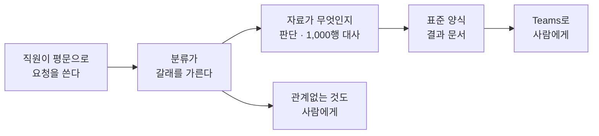

# 피날레 🏁

> **예상 시간**: 2분

---

## 오늘 한 것

파일 두 개를 넣었을 뿐인데, 여기까지 갔습니다.

부품 여섯이 각각 어디에 있었는지 되짚습니다.

| | 오늘 어디에 있었나 |
|---|---|
| [Agent](./glossary.html#agent) | 자료가 명세인지 대장인지 판단한 자리 |
| [Knowledge](./glossary.html#knowledge) | 정기결제 3건을 누락이 아니라 면제로 가른 근거 |
| [Skill](./glossary.html#skill) | 결과 문서가 회사 양식으로 나오게 한 것 |
| [Sandbox](./glossary.html#sandbox) | 1,000행을 열어 합계 `100,849,600` 을 맞춘 자리 |
| [Memory](./glossary.html#memory) | 새 대화에서 형식을 말하지 않았는데 사람별 목록으로 나온 것 |
| [Workflow](./glossary.html#workflow) | 사람이 창을 열지 않아도 시작되고, 평문을 갈래로 가른 것 |

**하나라도 빼면 무엇이 막히는지**를 오늘 직접 봤습니다. 기능 설명으로 배운 것이 아닙니다.

---

## 오늘 안 한 것

오늘의 범위가 아니어서 두고 온 것들입니다. 시간이 모자란 것과는 다릅니다.

| | 왜 안 했나 |
|---|---|
| 영수증 이미지 OCR | 갈아 끼울 수 있는 부품입니다. 품질을 보고 정할 문제라 본류에 두면 교육이 흔들립니다 |
| ERP 연동 | 부품은 오늘 전부 살아 있습니다. 붙는 것은 연동 설정과 실패 처리입니다 |
| 다국어 영수증 | 위와 같습니다 |
| 정책 예외 학습 | Memory의 다음 단계입니다. 오늘은 「기억한다 → 활용한다 → 되묻는다」까지입니다 |
| 사용량·비용 확인 | 화면에서 관찰되지 않습니다. Power Platform 관리 센터의 에이전트별 집계로 보고, 하루 늦게 확정됩니다 |

---

## 돌아가서 볼 것

**본인 업무에서 이 표의 여섯 칸이 다 차는 일이 무엇인지** 찾아봅니다. 하나라도 비면 그 부품은 그 업무에서 장식입니다.

| 부품 | 없으면 안 되는 것 |
|---|---|
| Workflow | 사람이 파일을 열어 시작해야 한다 |
| Agent | 자료가 무엇이고 어떤 처리인지 사람이 매번 판단해야 한다 |
| Knowledge | 처리 기준을 사람이 규정집에서 찾아야 한다 |
| Skill | 결과 문서가 회사 양식으로 나오지 않는다 |
| Memory | 같은 것을 매번 다시 묻는다 |
| Sandbox | 큰 파일 두 개를 맞춰 볼 방법이 없다 |

여섯 칸이 다 차는 가장 작은 업무를 고릅니다. 가장 좋은 업무가 아니라 **가장 작은** 업무입니다. 크게 잡으면 배우는 것이 엔진에서 연동 설정으로 바뀝니다.

---

{: .note }
오늘 만든 Agent와 Workflow는 그대로 남습니다. 재료를 본인 것으로 갈아 끼워 다시 돌려 봐도 됩니다. 다만 실제 카드 명세와 영수증은 올리지 마세요.
