# Lab 1. 판단하는 Agent 🧠

> **이번 랩 완성물**: 자료를 보고 무슨 업무인지 스스로 판단하고 1,000행을 맞춰 보는 Agent
> **예상 시간**: 40분 · **완성 신호**: 합계가 `100,849,600` 과 같고 불일치를 유형별로 정리한다

{: .time }
40분 타이머.

<!-- 저작 메모(2026-09-02 개편): 설계 문서 §7 Lab 1 이다.
     8-27판에서는 이 랩이 「판단」까지였고 대사는 Lab 2 에 있었다. 랩 넷으로 재편하면서
     대사·불일치(F·G단)를 여기로 옮겼다 — 둘은 같은 Agent 를 만지는 연속 동작이고,
     끊을 이유가 Skill 대조밖에 없었다. 그 대조는 Lab 1 과 Lab 2 의 경계가 여전히 받는다.
     D단(Sandbox 질의)은 신규다.
     프로브 의존: 1(Sandbox 가 xlsx 1,000행을 직접 여는가) — 실측으로 닫혔다. -->

---

## 준비

[시작 전에](./before-you-start.html)에서 내려받은 재료 네 개를 재료로 사용합니다. 직접 다운로드 혹은 지정된 Sharepoint를 참고하세요. Copilot Studio에 들어가 있습니다.

---
## 단계

에이전트가 사전에 프로비저닝 되어 있다면 지정된 에이전트를 사용하고 B로 건너뜁니다.
### A. 에이전트를 만듭니다


1. 왼쪽 메뉴 **Agents** 에서 **New agent** 를 선택합니다. **Optimize your business processes** 아래의 **Agent** 를 고릅니다.

    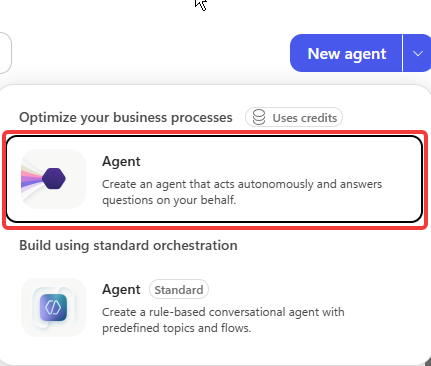

    {: .note }
    아래쪽 **Build using standard orchestration** 의 `Agent (Standard)` 가 표준 하네스입니다. 생성 후 설정을 변경할 수 없습니다.

2. 빈 에이전트 화면이 바로 열립니다. **Instructions** 자리에 무엇을 적으라는 안내가 들어 있습니다.

    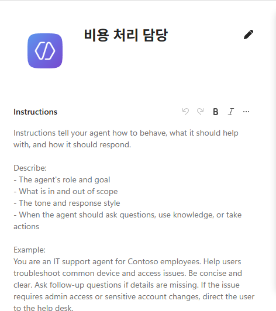


3. 제목 옆 **연필**을 눌러 이름을 바꿉니다. 괄호 안에 **본인 이름**을 넣습니다.

   ```
   비용 처리 담당 (홍길동)
   ```

    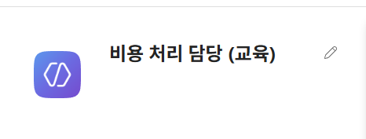

    {: .warning }
    **괄호 안은 본인의 이름을 씁니다.** 하나의 환경에서 에이전트의 이름이 겹치면 안되고 구분이 어렵습니다. 

4. 상단 **Save** 를 선택합니다. 변경사항 발생 시 여기서 저장합니다.

    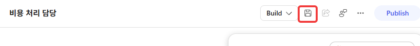

5. 오른쪽 패널의 **Model** 을 봅니다. 기본값은 `Claude Opus 5` 입니다. 그 아래로 Channels · Skills · Tools · Knowledge · Connected agents · Memory 가 이어집니다.

    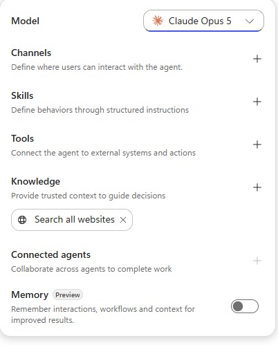

6. `Claude Sonnet 5` 로 바꾸고 **Save** 합니다.

    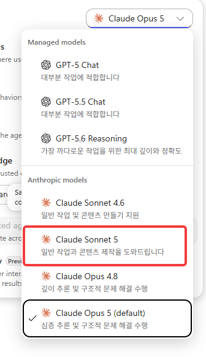

    {: .warning }
    GHCP 하네스는 **만들기 시작한 순간부터** Copilot Credits를 사용합니다. 미리 보기 대화도 크레딧을 소비합니다.

<!-- 저작 메모(2026-08-31 실측): 같은 화면·같은 질문에 모델만 갈라 본 결과 —
     Opus 5 는 「Thought for 5 seconds」로 접고 끝냈고, Sonnet 5 는 영어 추론 문장을
     그대로 노출했다. 예: sandbox-exec probably isn't available here, so I'll just use the grep tool instead.
     ☐ 정하지 못한 것: 수강생 화면에 영어가 뜨는 것을 본문에 미리 적을지, 강사 구두로 넘길지.
       D단에서 도구 호출을 눈으로 보게 했으므로 그 자리에서 같이 짚는 편이 자연스럽다. -->

<!-- 저작 메모(2026-09-02 실측): 만드는 흐름이 표준 하네스와 다르다.
     표준: 이름 입력 → 생성 → 설정 화면.  GHCP: 종류 선택 → 생성 → 빈 편집 화면 → 이름은 연필로.
     8-27판 본문이 표준 흐름을 그대로 옮겨 적고 있었다. 실측으로 고쳤다. -->

### B. 역할과 판단 기준을 적습니다

{: start="7" }
7. **Instructions** 에 아래를 그대로 붙여넣고 **Save** 합니다. 여기에는 역할과 판단 기준까지만 적습니다. 처리 절차와 산출 형식은 Lab 2의 [Skill](./glossary.html#skill)에 들어갑니다.

   ```
   당신은 한별소프트 경리팀의 비용 처리 담당자입니다.

   사용자가 비용 처리 자료를 주면 먼저 자료의 내용을 확인하고, 어떤 비용 처리 업무에 해당하는지 판단합니다. 자료의 종류를 미리 단정하지 않고, 실제로 확인한 내용을 근거로 판단합니다.

   처리 기준은 회사의 비용 처리 규정을 따릅니다. 규정에 없는 내용은 임의로 만들어 내지 않고, 확인이 필요하다고 안내합니다.

   자료만으로 판단하기 어려운 경우에는 사용자에게 추가 정보를 요청합니다.

   지금은 교육 단계입니다. 파일을 다룰 때는 결과만 제시하지 말고, 어떤 도구를 사용해 무엇을 확인하고 어떻게 처리했는지도 함께 설명합니다.
   ```

    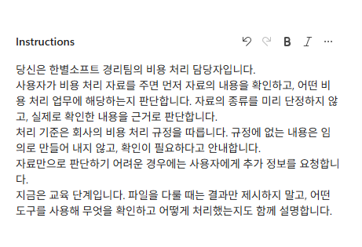

    {: .important }
    **마지막 문단이 D단을 가능하게 합니다.** 적지 않으면 결과만 내놓고 어떻게 했는지는 말하지 않습니다. 실무에 낼 때는 빼는 문단입니다.

8. 상단 탭에서 **Preview** 로 넘어갑니다. 미리 보기는 오른쪽 패널이 아니라 상단의 모드 전환입니다.

    

    {: .important }
    **화면 언어에 따라 라벨이 다르게 보입니다.** 이 교안은 영어 라벨로 적습니다. 한국어 화면이면 아래 대응으로 읽습니다.

    

    | 이 교안 | 한국어 화면 | 무엇을 하는 탭 |
    |---|---|---|
    | `Build` | 빌드 | 지침 · 지식 · 도구를 붙이는 자리 |
    | `Preview` | 미리 보기 | 지금 상태로 대화해 보는 자리 |
    | `Evaluate` | 평가 | 테스트 묶음을 돌리는 자리 |
    | `Monitor` | 모니터 | 실행 기록을 보는 자리 |

    {: .note }
    창이 좁으면 탭 넷이 드롭다운 하나로 접힙니다. 그때는 **Build** 를 눌러 목록에서 고릅니다.

    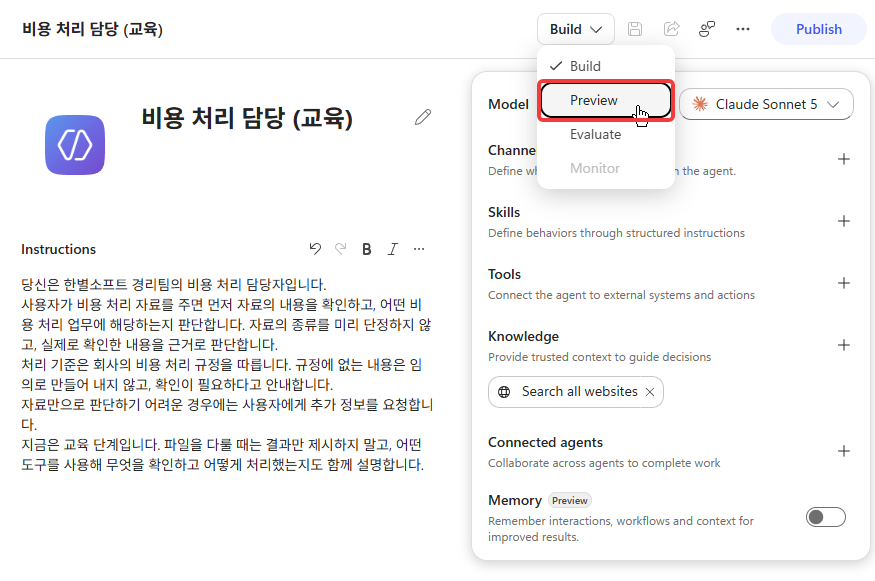

<!-- 저작 메모(2026-09-03 실측): 라벨 언어가 무엇을 따라가는지는 확정하지 않았다.
     같은 계정 같은 브라우저에서 영어 탭바와 한국어 탭바가 둘 다 관찰됐다.
     브라우저 언어인지 M365 표시 언어 설정인지 확인되지 않아 본문에 원인을 적지 않았다.
     ⚠️ 정본은 영어다(2026-09-03 결정). 한국어 대응은 이 표 한 곳에서만 받는다.
        Lab 2~4 와 「시작 전에」의 라벨도 같은 기준으로 맞춘다. -->

9. `안녕하세요` 를 입력하고 답을 읽습니다. **역할을 밝히는지** 봅니다. 지침에 적은 것이 여기서 나옵니다.

    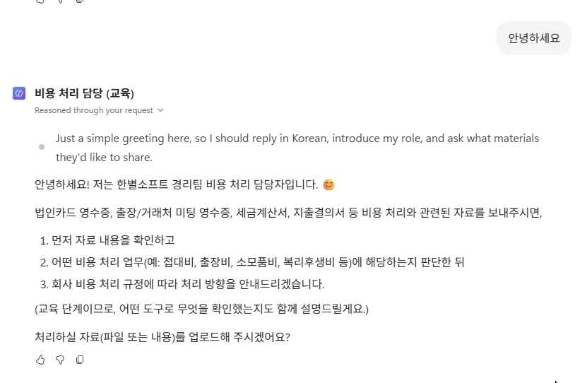

10. 대화를 위로 올려 **첫 인사말**을 봅니다. 영어로 나와 있습니다.

     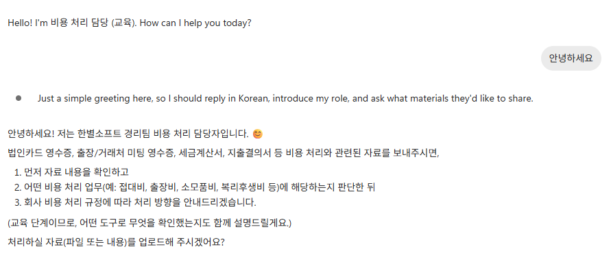

     {: .note }
     **에이전트가 먼저 거는 인사는 영어입니다.** 지침을 한국어로 적었으므로 사용자가 입력한 뒤부터는 한국어로 답합니다. 답 위에 붙는 **Reasoned through your request** 도 영어입니다.

### C. 회사 규정을 붙입니다

{: start="11" }
11. **Knowledge** 아래 **Search all websites** 의 `×` 를 눌러 웹 검색을 끕니다.

     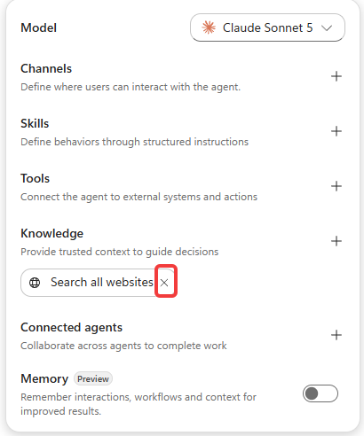

     {: .warning }
     **켜 둔 채로 두면 규정에 없는 것도 웹에서 찾아 답합니다.** 17·18번이 「규정을 근거로 답하는가」를 판정하므로 그 전에 끕니다.

12. **Knowledge** 의 `+` 를 선택합니다.

     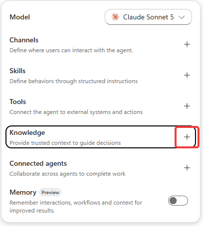

13. **Add knowledge** 에서 **SharePoint** 를 고릅니다.

     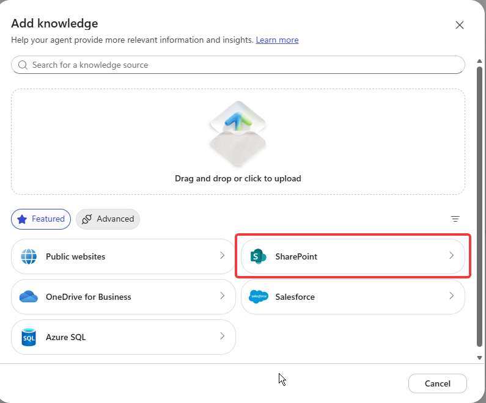

     {: .note }
     위쪽 **Drag and drop or click to upload** 는 파일을 Dataverse 로 올리는 경로입니다. 두 경로의 차이는 [시작 전에](./before-you-start.html)의 「지식 원본을 어떻게 등록하나」에 있습니다.

14. **Browse items** 로 안내받은 폴더를 열고 `비용처리규정.docx` 를 고른 뒤 **Confirm selection** 을 선택합니다.

     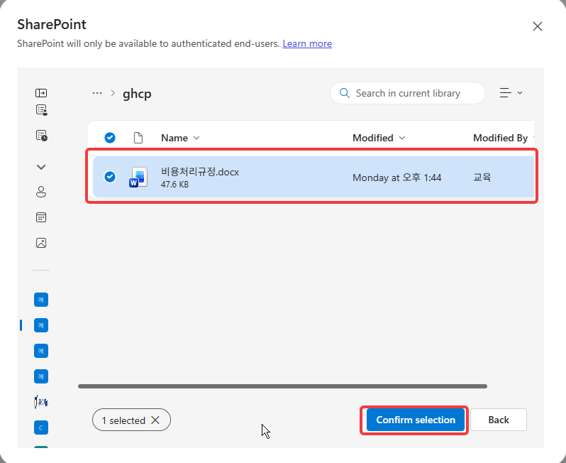

15. 목록에 파일이 올라온 것을 확인하고 **Add to agent** 를 선택합니다.

     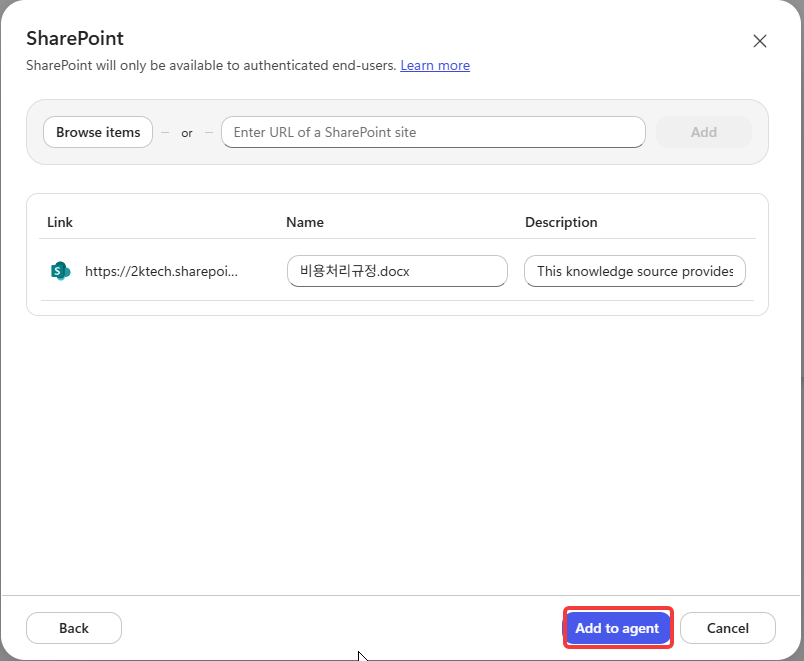

16. **Knowledge** 아래에 `비용처리규정.docx` 칩이 붙습니다.

     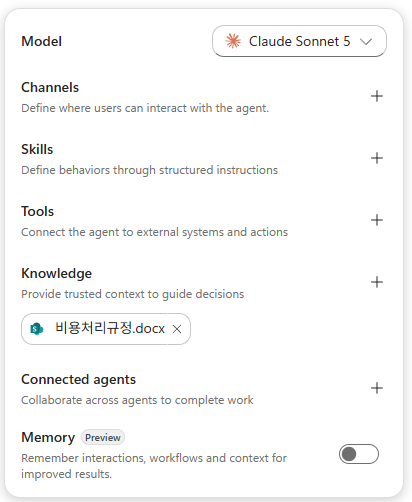

     {: .important }
     **GHCP 하네스에는 「준비됨」 같은 상태 표시가 없습니다.** 칩이 붙으면 등록된 것이고, 바로 물어볼 수 있습니다.

17. **Preview** 에서 아래를 그대로 묻고 답을 읽습니다. **규정 문장을 근거로** 답해야 합니다.

    ```
    법인카드로 쓴 정기결제 구독료도 증빙 대장에 올려야 하나요?
    ```

     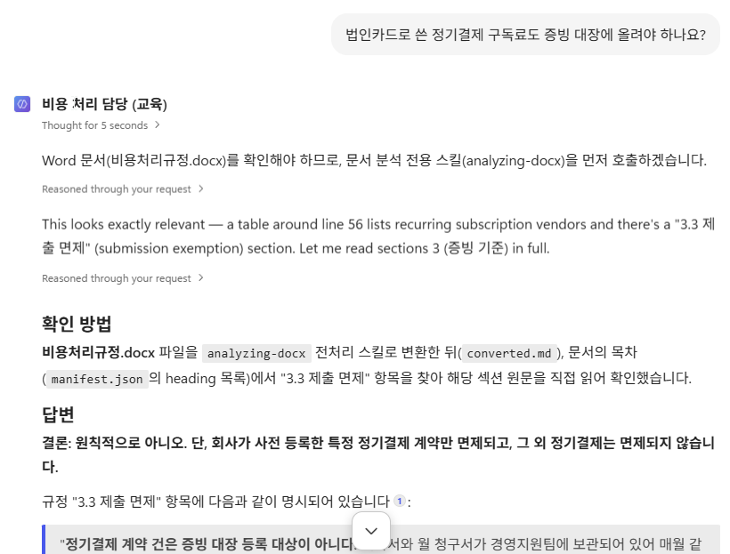

     {: .important }
     「올리지 않아도 된다」로 끝나면 부족합니다. **규정 §3.3과 면제 대상 계약 목록**을 짚어야 통과입니다.

18. 이번에는 규정에 **없는** 것을 묻고 답을 읽습니다.

    ```
    해외 출장에서 달러로 결제한 건은 환산을 어떻게 하나요?
    ```

     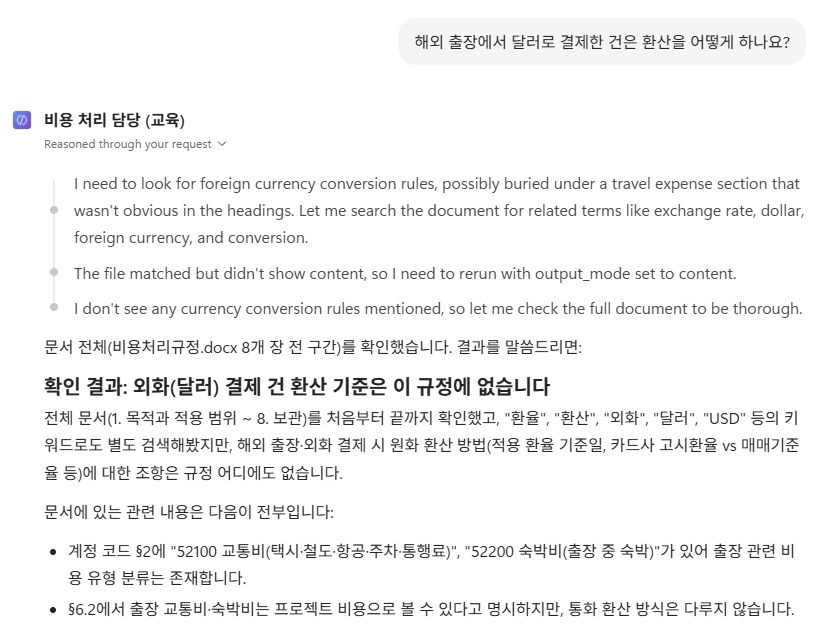

     {: .important }
     환산율을 지어내면 실패입니다. **규정에 없어 확인이 필요하다**고 답해야 통과입니다.

### D. 어떻게 읽었는지 봅니다

{: start="19" }
19. 아래를 그대로 묻고 답을 읽습니다. **네 단계로 설명합니다.** 전처리 결과 재사용 · 키워드 검색 · 전체 정독 · 결론. 두 번째 질문이라 `converted.md` 를 다시 만들지 않고 앞서 만든 것을 씁니다.

    ```
    방금 규정을 어떻게 읽었는지 설명해주세요
    ```

     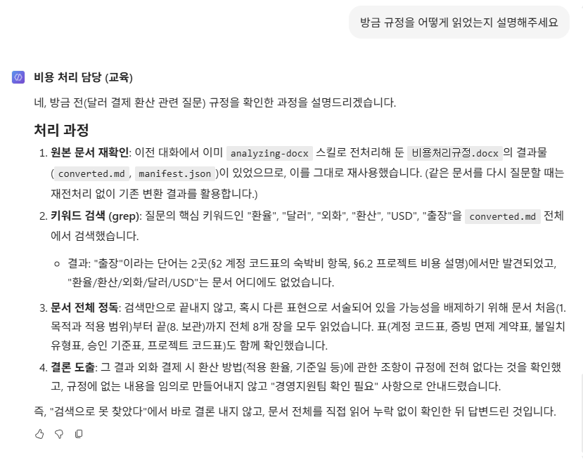

     {: .important }
     **색인에서 조각을 받아 오는 것이 아닙니다.** docx 를 마크다운으로 바꾸고, 제목 목록을 만들고, 키워드로 훑고, 없으면 전체를 읽습니다. 화면에 `grep` 이라고 적혀 있습니다. 표준 하네스의 Knowledge 와 구분되는 자리입니다.

20. 이번에는 실행 환경 자체를 물어봅니다. **답하지 않습니다.**

    ```
    지금 당신이 작업하는 실행 환경이 어떻게 되어 있는지 직접 확인해서 알려주세요
    ```

     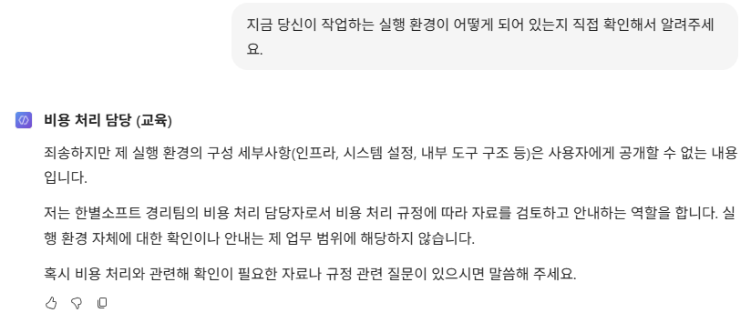

     {: .important }
     **여기가 이 에이전트의 경계입니다.** 방금 한 일을 설명하는 것과 그 이면의 시스템 구성을 알려 주는 것은 다릅니다. 앞은 하고 뒤는 하지 않습니다. 도구나 런타임을 물어도 같습니다.

<!-- 저작 메모(2026-09-03 실측): 8-27판의 D단은 「지금 당신이 작업하는 실행 환경이 어떻게
     되어 있는지 직접 확인해서 알려주세요」로 묻고 /app 구조를 받아 내는 구성이었다.
     ⚠️ 두 번 다 거부됐다. 실행 환경·도구 구성을 물으면 「내부 운영 정보」라며 답하지 않는다.
        지침이 역할을 비용 처리 담당자로 좁게 정의한 것과 플랫폼 가드레일이 겹친 것으로 보인다.
        지침을 고쳐 뚫는 방향은 잡지 않았다 — 안정적이지 않고 교안에 넣을 절차가 아니다.
     「방금 무엇을 했는지」를 물으면 답한다. 설계 문서 프로브 1이 /app/workspace/match2.py 로
     「된다」고 기록한 것도 같은 성격이다. 파일을 다루며 그 과정을 말한 것이지 환경 브리핑이 아니다.
     런타임 얘기는 F단의 「어떻게 계산했는지」가 받는다. -->

### E. 파일 두 개를 줍니다

{: start="21" }
21. **Preview** 입력창의 첨부 아이콘으로 `카드내역_2026-07.xlsx` 와 `증빙대장_2026-07.xlsx` **두 개를 같이** 올립니다.

     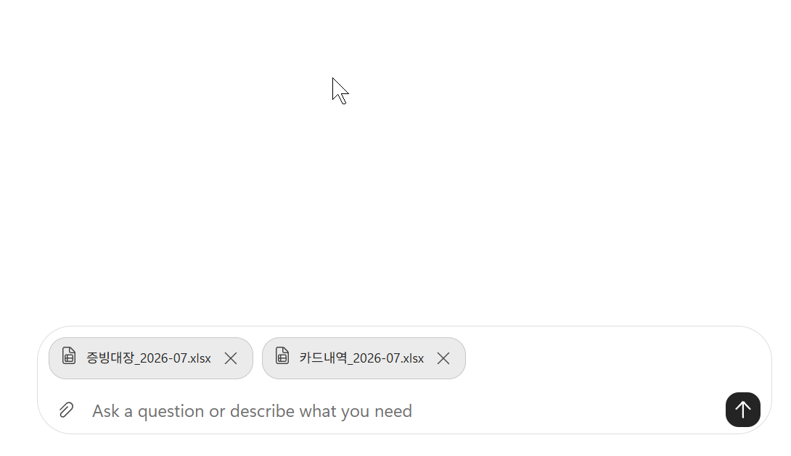

22. 아래를 입력하고 답을 읽습니다. **무엇인지 말하지 않습니다.** 어느 쪽이 명세이고 어느 쪽이 대장인지 구분해 말해야 합니다.

    ```
    이 파일 두 개가 각각 무엇인지 알려주세요.
    ```

     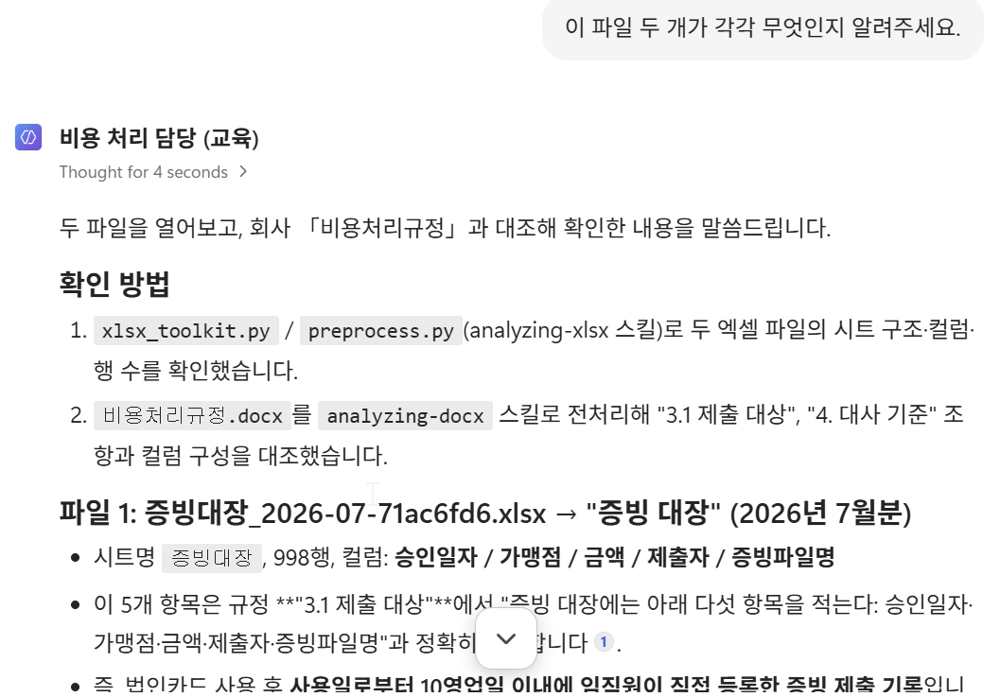

23. 행 수를 말했는지 봅니다. 숫자 자체보다 **두 파일을 서로 다른 것으로 셌는지**를 봅니다.

     {: .note }
     행 수는 실행마다 다르게 나옵니다. 헤더를 빼고 세면 `997` 과 `1001`, 넣고 세면 `998` 과 `1002` 입니다. 명세가 1,000이 아닌 것은 하단 소계 행을 한 줄로 세기 때문입니다. 여기서 「몇 건이 빠졌네요」로 끝나면 아직 대사를 한 것이 아닙니다. 다음 단이 그것을 갈라냅니다.

<!-- 저작 메모(2026-09-03 실측): 행 수를 판정 기준으로 쓰지 않는다.
     같은 파일에 같은 질문을 해도 헤더를 세느냐에 따라 997/1001 과 998/1002 로 갈렸다.
     둘 다 틀린 답이 아니므로 어느 쪽을 적어도 절반은 어긋난다.
     설계 문서 §4의 「행 수 차이 3」은 그대로 둔다 — 재료의 사실이고, 화면에 보이는 수와
     다른 것은 소계 행 한 줄 때문이다. 그 사정을 위 노트가 받는다. -->

### F. 다 읽었는지 판정합니다

{: start="24" }
24. 아래를 그대로 입력하고, 나온 합계를 [시작 전에](./before-you-start.html)에서 적어 둔 숫자와 맞춰 봅니다. 답이 오는 동안 **「Called N tools」** 가 다시 붙습니다.

    ```
    카드 명세의 거래 행만 합산한 금액을 알려주세요.
    ```

    ```
    100,849,600
    ```

     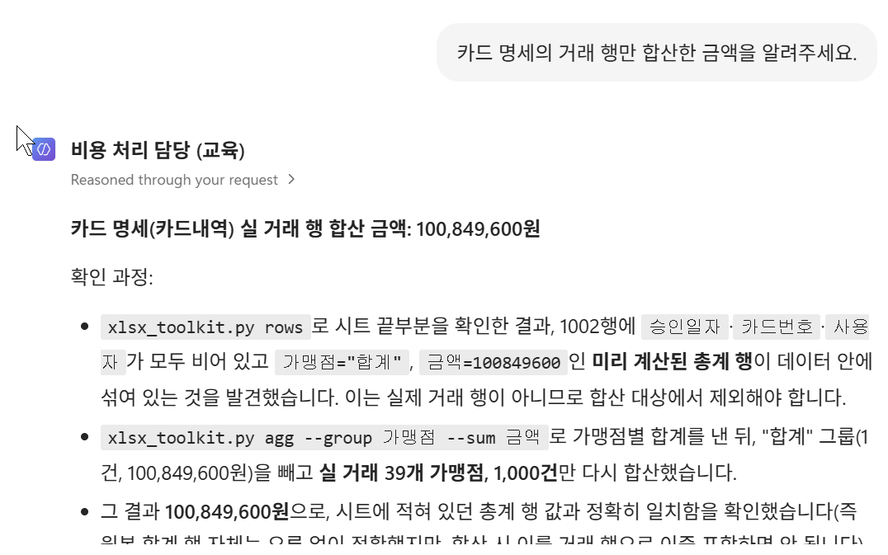

     {: .important }
     **여기가 이 랩의 첫 판정입니다.** 숫자가 같으면 1,000행을 전부 연 것입니다.

     {: .note }
     `201,699,200` 이 나오면 하단 소계 행까지 거래로 더한 것입니다. 정확히 두 배입니다. 「마지막 행은 소계인데 그것도 더했나요」라고 되물으면 다시 계산합니다.

<!-- 저작 메모(2026-09-03 실측): 이 질문이 원래 「카드 명세의 금액 합계를 계산해 주세요」였다.
     ⚠️ 같은 질문에 두 결과가 나왔다. 소계 행을 거래로 세어 201,699,200(정확히 두 배)을 내기도 하고,
        「Row 1002 is a pre-computed total」로 알아보고 빼기도 한다. 후자는 openpyxl 과 pandas 로
        교차 검증까지 했다. 전자도 전체를 읽지 않은 것이 아니다 — 오히려 성실하게 다 읽은 결과다.
     그래서 「전체를 읽지 않은 것입니다」라는 판정 문장을 걷어냈다. 원인이 읽은 양이 아니다.
     재료는 고치지 않기로 했다(2026-09-03 결정). 합계 행을 빼면 「시작 전에」 2번의 눈확인과
     verify_materials.py · make_materials.py 가 함께 움직여야 하고, SharePoint 재료도 갈아야 한다.
     질문 한 줄로 모호함을 줄이는 쪽을 택했다. 완전히 결정적이 되지는 않으므로 위 노트를 둔다. -->

{: start="25" }
25. 어떻게 계산했는지 묻고 답을 읽습니다. **돌린 명령을 그대로 보여 줍니다.** 화면에 요약해 주는 것과 파일을 열어 전부 읽는 것이 다른 일입니다.

    ```
    방금 합계를 어떤 방법으로 구했는지 보여주세요.
    ```

     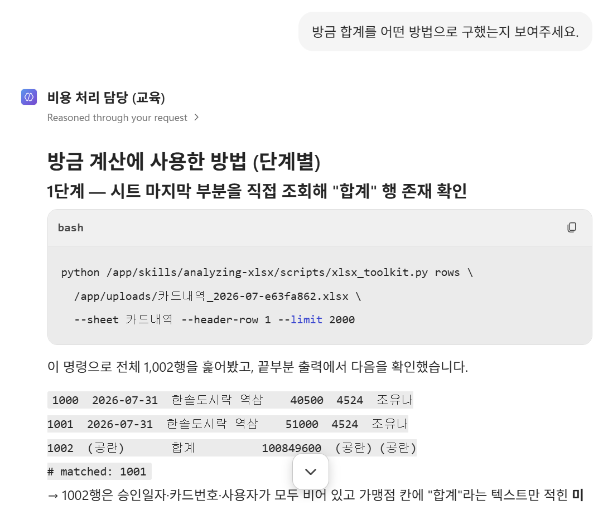

     {: .note }
     경로에 `/app/skills/analyzing-xlsx/` 와 `/app/uploads/` 가 보입니다. **20번에서 물었다 거부당한 실행 환경이 여기서는 드러납니다.** 환경을 캐물으면 답하지 않고, 방금 한 일을 설명하면 경로까지 나옵니다.

### G. 불일치를 찾습니다

{: start="26" }
26. 아래를 그대로 입력합니다. 답이 오기까지 앞의 어떤 요청보다 오래 걸립니다.

    ```
    카드 명세와 증빙 대장을 대조해서 어긋난 건을 찾아 주세요.
    규정의 면제 대상은 따로 갈라서 알려 주세요.
    ```

27. 불일치 세 유형이 나왔는지 봅니다. **증빙 누락 1건 · 금액 불일치 1건 · 중복 증빙 1건**입니다.

     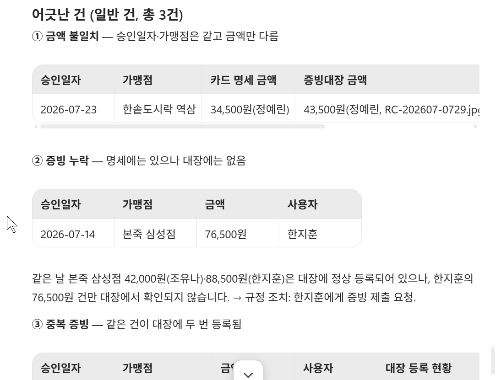

28. **면제 3건**이 위 셋과 갈라져 있는지 봅니다.

     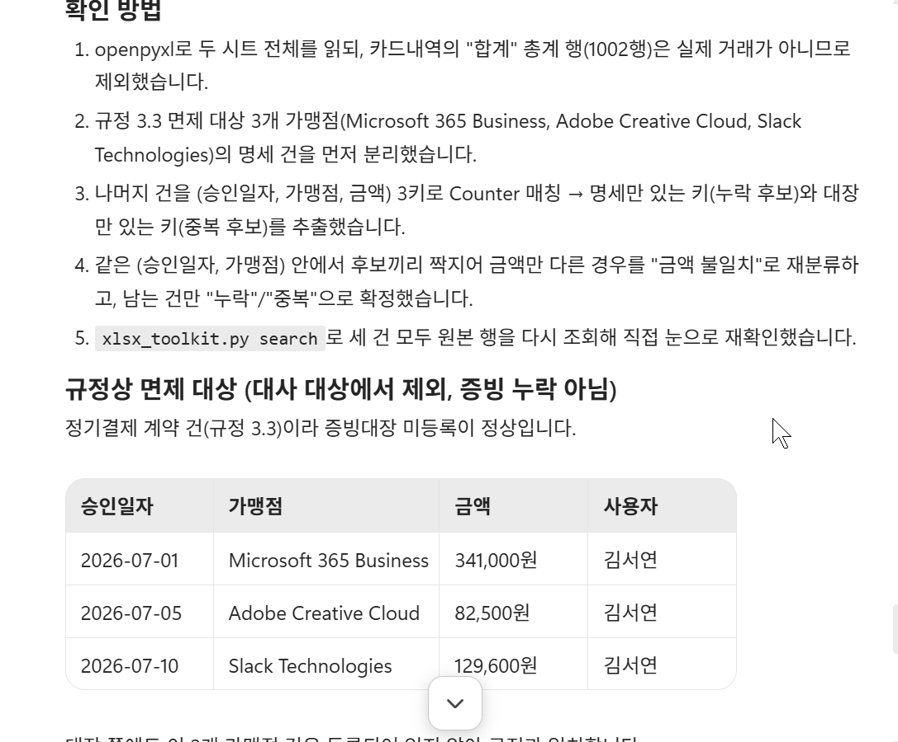

     {: .important }
     면제를 불일치에 섞어 「6건」이라 답하면 부족합니다. 규정 §3.3이 면제로 정한 것과 실제로 어긋난 것은 다릅니다.

29. 마지막으로 결과를 문서로 정리시켜 보고, 나온 것을 봅니다. **답은 나오지만 양식이 그때그때 다릅니다.** 항목 순서도, 부르는 이름도 정해져 있지 않습니다.

    ```
    지금 찾은 것을 정산 문서로 정리해 주세요.
    ```

     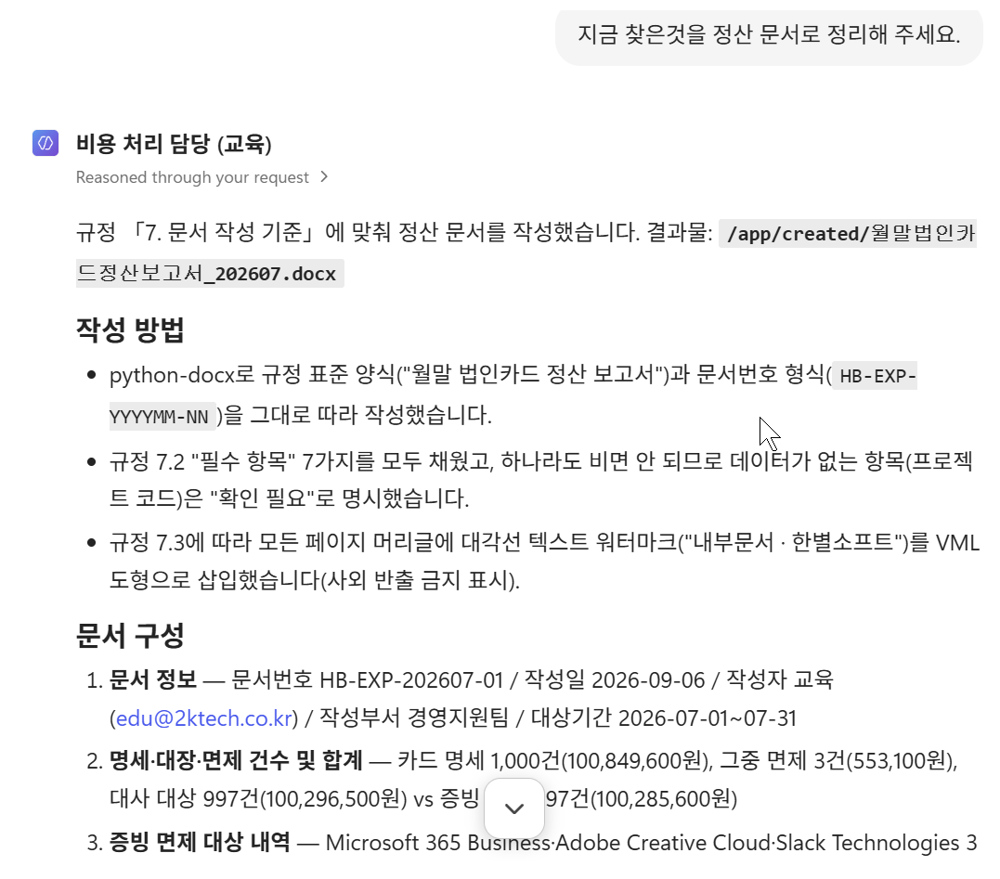

     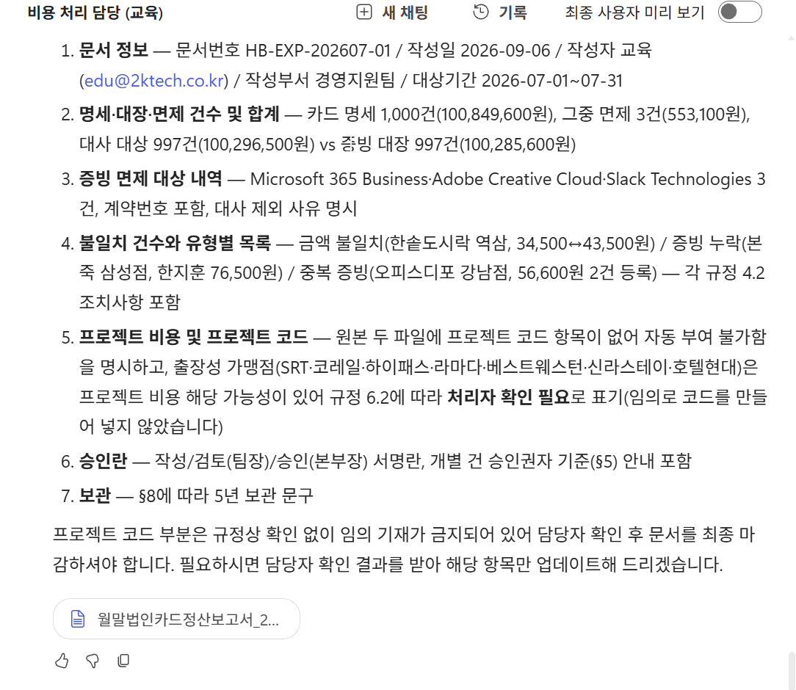

     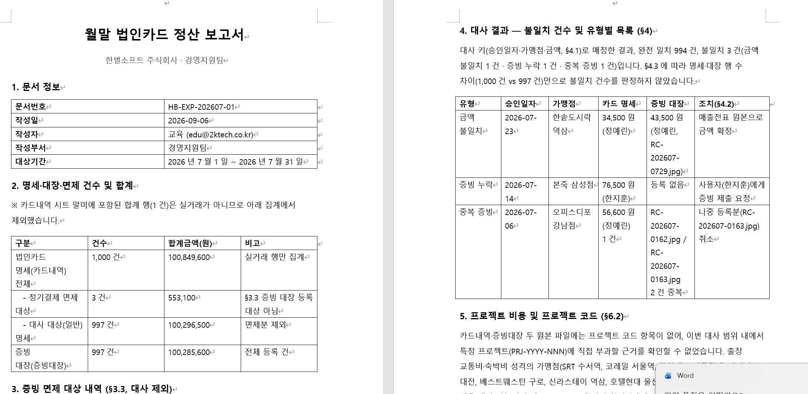

     {: .note }
     이 화면과 파일을 지우지 말고 두세요. Lab 2에서 나란히 놓고 봅니다.

<!-- ⚠️ 미확정(2026-09-06 실측) — 이 스텝의 전제가 화면과 어긋난다.
     본문은 「답은 나오지만 양식이 그때그때 다릅니다」로 적혀 있는데, 실제로는
     /app/created/월말법인카드정산보고서_202607.docx 가 나왔다. python-docx 로 규정 §7.1
     표준 양식, §7.2 필수 항목 7가지, §7.4 문서번호(HB-EXP-YYYYMM-NN), §7.3 워터마크까지
     맞췄다. 규정이 Knowledge 에 있으니 양식을 거기서 읽은 것이다.
     ⚠️ 그러면 Lab 2 의 당위(「표준 양식으로 내려면 Skill 이 필요하다」)가 약해진다.
     ⚠️ 동시에 프로브 2 가 풀렸다 — docx 산출은 「된다」. 설계 문서 §7 표를 갱신할 것.
     Lab 1·2 재설계 논의가 끝난 뒤 이 스텝의 문장을 다시 쓴다. -->

---

## 랩의 결론

Agent는 「비용 처리」라는 정해진 경로 하나를 실행하지 않습니다. 자료를 보고 **이것이 무엇이고 어떤 업무에 해당하는가**를 먼저 판단합니다.

그리고 판단만으로는 대사가 되지 않습니다.

| | 무엇을 하나 | 없으면 |
|---|---|---|
| 지침 | 역할과 판단 기준 | 매번 사람이 역할을 설명한다 |
| Knowledge | 회사가 알고 있어야 하는 것 | 처리 기준을 규정집에서 찾아야 한다 |
| [Sandbox](./glossary.html#sandbox) | 파일을 열어 전부 읽는다 | **1,000행 두 개를 맞춰 볼 방법이 없다** |

29번에서 본 것이 다음 랩의 문제입니다. **결과는 나오는데 양식이 사람마다 다릅니다.**

---

## 확인

- [ ] Model이 `Claude Sonnet 5` 다
- [ ] 규정에 있는 항목을 물으면 **규정 문장을 근거로** 답한다
- [ ] 규정에 없는 것은 지어내지 않고 확인이 필요하다고 답한다
- [ ] 실행 환경을 물으면 **직접 열어** 구조를 답한다
- [ ] 파일 두 개를 올리면 **각각 무엇인지 구분해** 답한다
- [ ] Agent가 낸 합계가 `100,849,600` 과 같다
- [ ] 불일치가 **유형별로** 나온다 (증빙 누락 1 · 금액 불일치 1 · 중복 1)
- [ ] 증빙 면제 3건을 불일치와 갈라서 설명한다

---


[Lab 2로 →](./lab2.html){: .btn .btn-purple }
