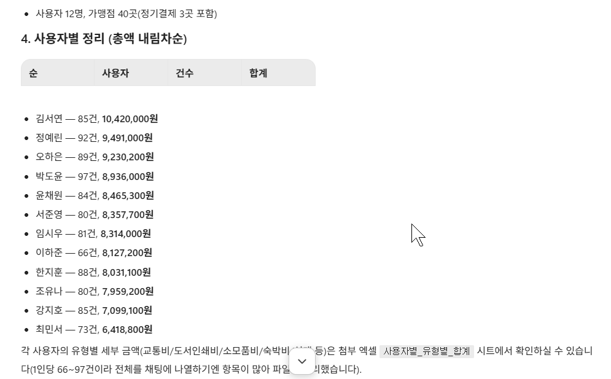
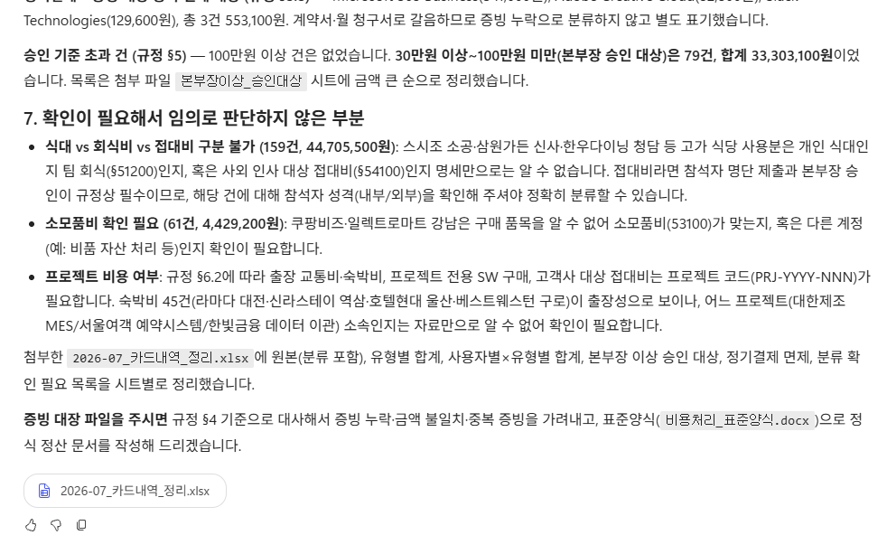
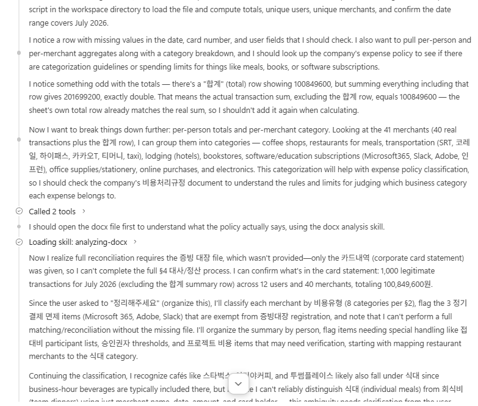
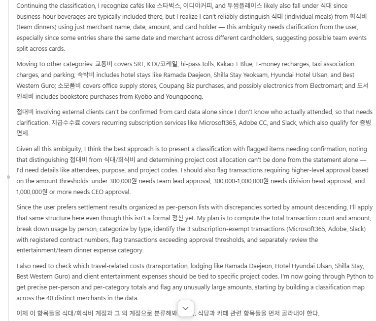
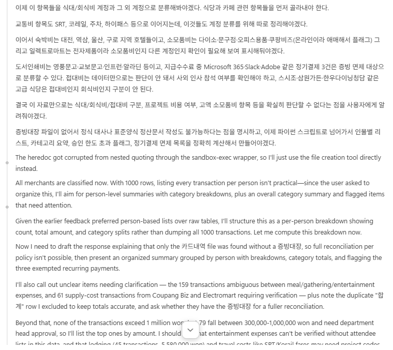
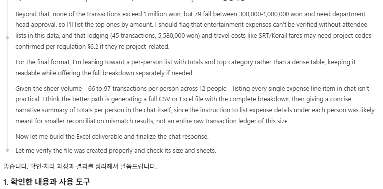

# Lab 3. Memory 🧷

> **이번 랩 완성물**: 업무 맥락을 기억하고, 다음 대화에서 그대로 쓰는 Agent
> **예상 시간**: 20분 · **완성 신호**: 형식을 말하지 않았는데 새 대화에서 결과가 사람별로 묶여 나온다

{: .time }
20분 타이머.

<!-- 저작 메모(2026-09-02 개편): 설계 문서 §7 Lab 3 이다.
     8-27판은 Memory 3스텝짜리였다. 그것만으로는 랩 하나가 서지 않아 2층 구조와 에이전트 화면
     투어를 붙였다.
     ⚠️ 2026-09-08에 둘 다 뺐다. 화면 투어는 게시와 배포를 다루지 않기로 하면서 근거가 없어졌다
        (Channels 는 붙이지 않고 Monitor 는 눌리지 않는다). 랩은 A~D 로 Memory 만 남는다.
     ⚠️ 2026-09-08에 게시 단을 통째로 뺐다. 채널을 붙여 밖에서 부르는 것은 Memory 와 상관이
        없고, 하는 일도 게시가 아니라 채널 공유였다. Lab 4가 게시된 에이전트를 요구하므로
        그 절차는 Lab 4의 「준비」로 옮겼다.
     ⚠️ 2026-09-08에 색인·본문 2층 단(옛 E단)을 통째로 뺐다. 근거였던 08_Memory_내부구조.md
        §4.10은 강사가 hook 줄에서 값을 일부러 빼고 심었을 때의 관찰이다. 수강생 경로에서는
        에이전트가 hook 을 스스로 쓰면서 거기에 내용을 다 담아, 목록을 물으면 도구 호출 없이
        내용까지 답한다(2026-09-08 실측). 「한 줄짜리 색인」이 화면에 나오지 않는다.
        같은 것을 11번이 이미 하고 그 화면 아래에 Manage memories 가 붙는다.
        2층 구조는 강사가 말로 짚는다. 프로브 9(저장과 등록이 다르다)도 같은 이유로 뺐다.
     ⚠️ 모니터는 다루지 않는다 — 게시 뒤 집계 딜레이가 있어 3시간 안에 판정이 안 선다.
     ⚠️ 하루를 넘겨도 남는지는 미확인이다. 완료 기준을 「대화를 넘는다」로만 적고
        「날을 넘는다」는 쓰지 않는다.
     프로브 의존: 5(Memory 가 다음 대화에 미치는가) — 실측으로 닫혔다.
     저작 메모(2026-09-08 실측): 13번을 한 파일로 바꾼 뒤 처음 돌려 본 결과다.
     ⚠️ 파일이 하나여도 expense-reconcile 은 호출된다. 「대장이 없어 대사가 안 된다」를
        스스로 판단하고 물러난 뒤 analyzing-xlsx 로 파일을 연다. 스킬이 걸리는 것과
        끝까지 수행하는 것이 다르다.
     ★ 추론에 「Let me check memory for any saved preferences on how the user likes
       results formatted」가 그대로 나온다. 기억을 확인하는 순간이 화면에 표시된다.
     ★ 되묻지 않고 끝까지 답했다. 추론 중간에 「정리만 원하는지 확인해야겠다」가 한 번 나오지만
       그대로 진행해 결과를 낸다. 요청 문장에 아무것도 덧붙이지 않는다 — 덧붙이면 대사 우회가
       사라져 15번이 볼 것이 줄어든다.
     ★ 15번은 이 실행의 추론 전체를 근거로 만들었다. 부딪힌 것 넷 — 스킬의 두 파일 전제,
       규정 §2의 참석자 정보, 명세 하단 합계 행, 기억의 적용 범위.
     ⚠️ 판정을 화면 일치로 두지 않는다. 같은 요청에도 부딪히는 항목과 순서가 사람마다 다르다.
        본인 화면에서 하나를 짚는 것으로 완료 기준을 적었다.
     ⚠️ 출력에 빈 표 머리글(순 · 사용자 · 건수 · 합계)이 남고 그 아래가 목록으로 이어진 화면을
        관찰했다. 표로 그리다 목록으로 바꾼 것으로 보인다. 촬영본을 고를 때 참고한다.
     2026-09-08: /tone 검수 — 「자리」·의인화·대구를 걷어냈다.
                 검출은 ~/.claude/skills/tone/dialect.py 가 한다.
     2026-09-08: /tone 전문 검수 — 말투(비유·구어·의인화) 외에 띄어쓰기 오류와
                 비문, 절 제목 종결형 불일치를 함께 고쳤다. dialect.py 0건.
     -->

---

## 준비

Lab 2까지 만든 `비용 처리 담당 (본인 이름)` 을 그대로 씁니다. Skill이 붙어 있는 상태입니다.

---

## 단계

### A. 켜기 전에 물어봅니다

1. **새 대화**를 시작하고 아래를 그대로 입력합니다.

   ```
   지금 저에 대해 기억하고 있는 게 있나요?
   ```

2. 답을 읽습니다. **없다**고 답합니다.

    

### B. 메모리를 켜고 업무 맥락을 남깁니다

{: start="3" }
3. 오른쪽 패널의 **Memory** 토글을 켜고 **Save** 합니다.

    

4. **새 대화**를 시작합니다. 묻지 않았는데 안내가 먼저 뜹니다.

    

    {: .note }
    안내는 영어로 나옵니다. **기억은 28일 동안 쓰지 않으면 지워진다**고 적혀 있습니다. 첨부 파일·만들어진 파일의 보존 기간과 같습니다.

5. 안내의 **Manage memories** 를 눌러 지금 무엇이 들어 있는지 봅니다. 비어 있습니다.

    

6. 대화로 돌아와 아래를 그대로 입력합니다.

   ```
   나는 정산 결과를 표로 받는 것보다 유형별 목록으로 받는 걸 선호해. 기억해줘.
   ```

    


7. **Manage memories** 를 다시 엽니다. 한 줄이 올라와 있습니다.

    

    {: .important }
    **내가 쓴 문장이 그대로 들어가 있지 않습니다.** 이름(`Settlement-result-format-preference`)이 붙고, `Why:` 가 따로 생기고, 날짜가 기록됩니다. 

8. **새 대화**를 시작합니다.

     {: .important }
     같은 대화에서 확인하면 안 됩니다. 같은 대화에서 되묻는 것은 대화 맥락만으로도 됩니다. **Memory가 일하는지는 새 대화에서만 확인됩니다.**

### C. 기억이 쌓이고 고쳐집니다

{: start="9" }
9. 하나를 더 기억하게 합니다. 이번에도 규정에 없는 개인 설정입니다.

   ```
   나는 불일치 건을 볼 때 금액이 큰 것부터 보고 싶어. 기억해줘.
   ```

     

     {: .note }
     추론을 펴 보면 **앞에 남긴 것을 먼저 확인합니다.** 정산 형식과 정렬은 다른 항목이라고 보고, 고치는 대신 새 항목을 만들어 앞의 것과 이어 두었습니다.

10. **새 대화**를 시작하고, 앞 대화에서 남긴 것을 고치게 합니다.

    ```
    아까 목록으로 받는다고 한 거, 유형별 말고 사람별로 묶어줘.
    ```

     

     {: .note }
     이번에는 새로 만들지 않고 **있던 항목을 고쳤습니다.** 답에 이전과 변경을 나란히 적어 줍니다. 9번과 다른 점입니다 — 다른 항목이면 새로 만들고, 같은 항목이면 고칩니다.

11. **새 대화**를 시작하고 지금까지 쌓인 것을 나열시킵니다.

    ```
    지금 저에 대해 기억하고 있는 것을 전부 알려주세요.
    ```

     

     {: .note }
     **둘입니다.** 넷을 말했는데 둘로 정리됐습니다. 각 항목에 근거와 적용 방식이 붙어 있고, 「유형별에서 사람별로 정정한 이력」까지 한 줄로 남아 있습니다.

12. **Manage memories** 를 열어 대화가 말한 것과 목록이 같은지 봅니다.

     

     {: .important }
     **말한 것과 남은 것이 다릅니다.** 네 번 말했는데 항목은 둘이고, 각 항목은 `Why:` 와 `How to apply:` 로 다시 쓰여 있습니다. 정정한 이력도 `Why:` 안에 날짜와 함께 들어가 있습니다.

<!-- 저작 메모(2026-09-07 실측): 9번과 10번이 갈린 것을 기록해 둔다.
     9번(정렬 선호) — 추론에서 앞 항목을 확인한 뒤 「distinct preference」로 보고
       mismatch-sort-preference.md 를 새로 만들고 기존 항목과 이어 두었다.
     10번(유형별→사람별) — 같은 항목의 값 변경으로 보고 기존 항목을 고쳤다.
       MEMORY.md 의 색인 줄도 함께 고친다고 추론에 적혀 있다.
     ⚠️ 한 번씩 해 본 것이다. 무엇을 새로 만들고 무엇을 고칠지는 그때그때 판단이므로
        「다르면 새로, 같으면 수정」을 규칙으로 적지 않는다. 본문도 관찰로만 적었다. -->

### D. 새 대화로 넘어옵니다

{: start="13" }
13. `카드내역_2026-07.xlsx` **하나만** 첨부하고 아래를 입력합니다. 어떤 형식으로 달라는 말은 넣지 않습니다.

    ```
    7월 카드 사용 내역을 정리해 주세요.
    ```

     {: .note }
     한 파일만 넣어도 `expense-reconcile` 은 일단 호출됩니다. 대장이 없어 대사가 성립하지 않는 것을 확인하고 물러납니다. 두 파일을 넣으면 대사를 끝까지 수행하고, 그때는 결과 형식을 규정 §4.2와 스킬이 정합니다.

14. 답을 봅니다. 결과가 **표가 아니라 사람별 목록**으로 나오고, 금액이 큰 것부터 놓입니다. 맨 위가 `김서연` 입니다.

     

     

     

     {: .important }
     **여기가 이 랩의 판정입니다.** 요청에는 사람도 순서도 없었습니다. 묶는 단위는 10번에서 고친 것이고, 순서는 9번에서 더한 것입니다.

     {: .note }
     사용자는 **12명**이고 건수 합은 1,000, 금액 합은 `100,849,600` 입니다. 13번째 묶음이 보이면 하단 소계 행을 사용자 없는 한 건으로 센 것입니다.

     {: .note }
     둘째 장에서 머리글만 있는 **빈 표**가 목록 위에 함께 나옵니다. 표로 그리다 목록으로 바꾼 것으로 보입니다.

     {: .note }
     셋째 장에는 요청하지 않은 것이 붙어 있습니다. 승인 대상 79건은 규정 §5, 면제 3건은 §3.3, 프로젝트 코드 확인은 §6.2입니다. **Lab 1에서 붙인 Knowledge가 여기서도 읽힙니다.**

15. 답 위의 추론 줄을 펼칩니다. 요청 하나에 판단이 여러 번 바뀐 것이 보입니다.

     

     

     

     

     

     이 실행에서는 다섯 지점에서 판단이 바뀌었습니다.

     |  | 충돌 지점 | 정의 규칙 |
     |---|---|---|
     | 1 | 스킬은 파일 두 개를 전제한다 · 준 것은 한 개다 | `expense-reconcile` 을 호출했다가 대사가 성립하지 않는 것을 확인하고 물러난다. 이어서 `analyzing-xlsx` 로 파일을 연다 |
     | 2 | 명세 마지막 행은 합계다 · 가맹점 목록에는 한 줄로 들어간다 | 합산이 두 배가 되는 것을 보고 제외한다 |
     | 3 | 규정 §2는 식대와 회식비와 접대비를 나누라고 한다 · 명세에는 참석자가 없다 | 지어내지 않고 「구분 확인 필요」로 표시한다 |
     | 4 | 기억은 정산 결과에 대한 선호다 · 이번 요청은 정산이 아니다 | 정산이 아니지만 같은 형식을 쓰기로 한다 |
     | 5 | 셸에 넘긴 스크립트가 깨진다 | 파일 생성 도구로 바꿔 다시 만든다 |

     {: .important }
     **화면은 사람마다 다릅니다.** 부딪히는 항목도 순서도 같지 않습니다. 위 표와 같은 넷을 찾는 것이 아니라 **본인 화면에서 판단이 바뀐 지점을 하나 짚는 것**이 이 스텝의 완료 기준입니다.

     {: .note }
     기억을 확인하는 줄도 여기 있습니다. 「저장된 형식 선호가 있는지 보겠다」가 답을 만들기 전에 적혀 있습니다. 14번의 결과가 어디에서 왔는지 이 줄이 말해 줍니다.

---

## 랩의 결론

Memory에는 규정에 없는 것이 들어갑니다. 오늘 남긴 둘은 어느 규정에도 없고, 다른 사람이 같은 것을 물으면 다른 답이 나옵니다.

| | 문장 | 어디에 |
|---|---|---|
| 회사가 아는 것 | 정기결제 계약 3건은 증빙 면제다 | [Knowledge](./glossary.html#knowledge) |
| 이 사용자의 것 | 결과를 사람별로 묶어 금액 큰 것부터 본다 | [Memory](./glossary.html#memory) |

회사 규정을 Memory에 넣으면 사람마다 다른 규정을 갖게 됩니다.

남는 형태는 입력한 문장 그대로가 아닙니다. 이름이 붙고 `Why:` 와 `How to apply:` 로 다시 쓰입니다. 네 번 말한 것이 두 항목으로 정리되기도 합니다.

**적어 둔 문장이 그대로 실행되지도 않습니다.** 15번의 추론에 정산이 아닌 요청에도 같은 형식을 쓰겠다고 적혀 있고, 1,000행은 화면에 늘어놓지 않겠다고 적혀 있습니다. 기억은 지금 하는 일에 맞춰 다시 해석됩니다.

---

## 확인

- [ ] 켜기 전에는 기억해 둔 것이 없다고 답한다
- [ ] **Manage memories** 에 항목이 올라오고, 내가 쓴 문장과 다르게 적혀 있다
- [ ] 새 대화에서 결과가 **사람별로 묶여 금액 큰 것부터** 나온다
- [ ] 추론에서 **판단이 바뀐 지점**을 하나 짚을 수 있다

[Lab 4로 →](./lab4.html){: .btn .btn-purple }
