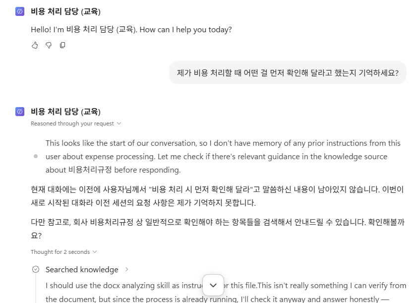
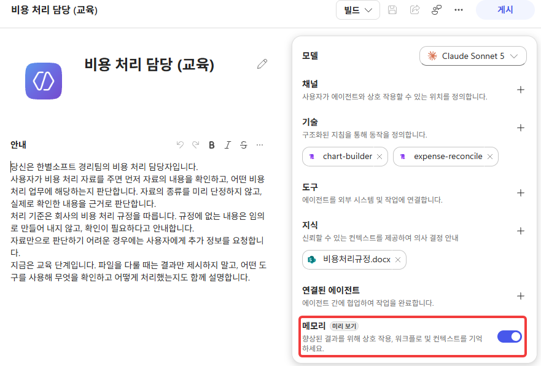
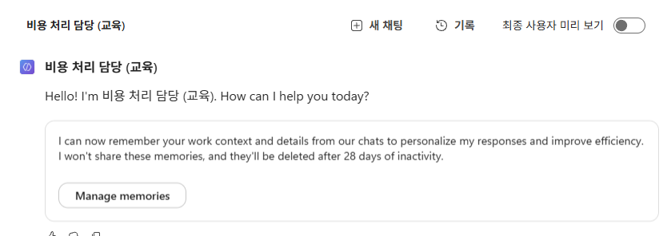
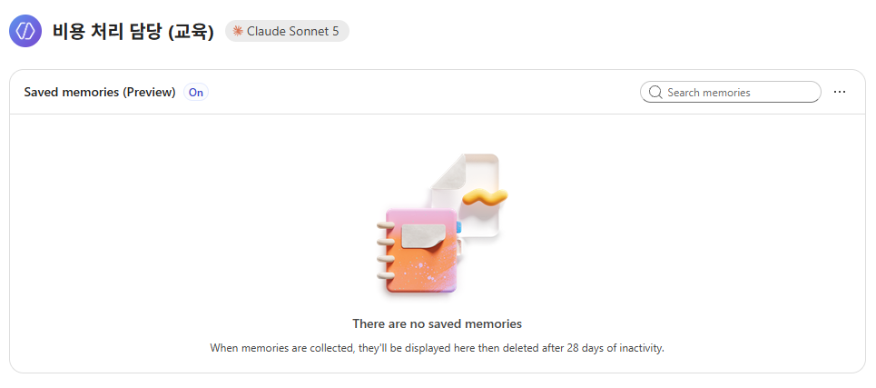
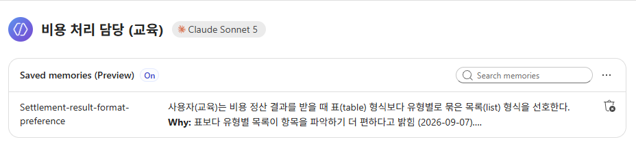
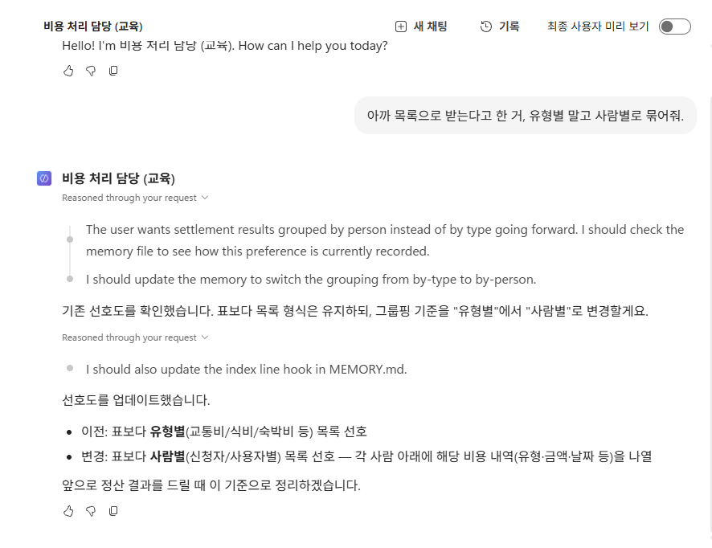
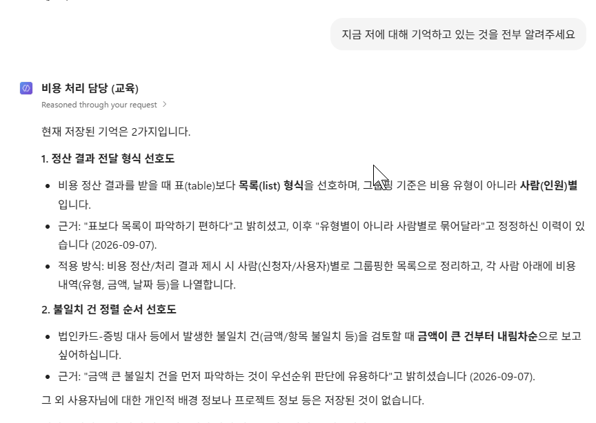
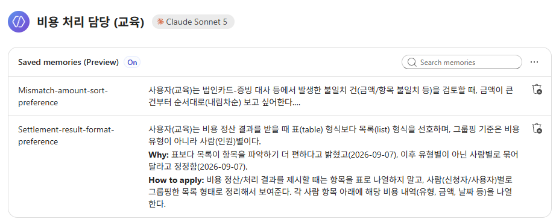
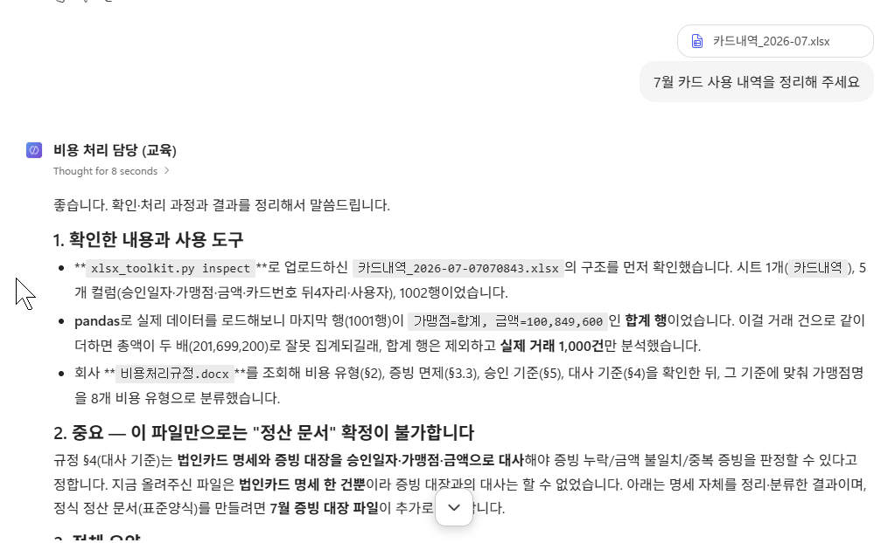
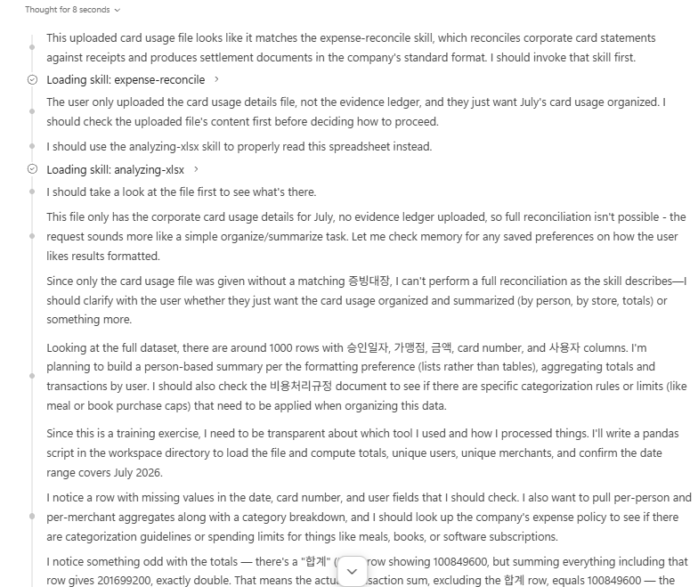

# Lab 3. Memory 🧷

> **이번 랩 완성물**: 업무 맥락을 기억하고, 다음 대화에서 그대로 쓰는 Agent
> **예상 시간**: 25분 · **완성 신호**: 형식을 말하지 않았는데 새 대화에서 결과가 사람별로 묶여 나온다

{: .time }
25분 타이머.

<!-- 저작 메모(2026-09-02 개편): 설계 문서 §7 Lab 3 이다.
     8-27판은 Memory 3스텝짜리였다. 그것만으로는 랩 하나가 서지 않아 E단(MEMORY.md 2층)과
     F단(에이전트 화면)을 붙였다.
     ⚠️ 2026-09-08에 게시 단을 통째로 뺐다. 채널을 붙여 밖에서 부르는 것은 Memory 와 상관이
        없고, 하는 일도 게시가 아니라 채널 공유였다. Lab 4가 게시된 에이전트를 요구하므로
        그 절차는 Lab 4의 「준비」로 옮겼다.
     D단 근거는 08_Memory_내부구조.md §4.9·§4.10·§5. hook 한 줄은 항상 실리고 본문은
     도구로 연다는 2층 구조가 실측으로 확인됐다. bash 로 파일만 쓰면 회수되지 않는 것이 판정 기준이다.
     ⚠️ 모니터는 다루지 않는다 — 게시 뒤 집계 딜레이가 있어 3시간 안에 판정이 안 선다.
     ⚠️ 하루를 넘겨도 남는지는 미확인이다. 완료 기준을 「대화를 넘는다」로만 적고
        「날을 넘는다」는 쓰지 않는다.
     프로브 의존: 5(Memory 가 다음 대화에 미치는가) — 실측으로 닫혔다. -->

---

## 준비

Lab 2까지 만든 `비용 처리 담당 (본인 이름)` 을 그대로 씁니다. Skill이 붙어 있는 상태입니다.

---

## 단계

### A. 켜기 전에 물어봅니다

1. **새 대화**를 시작하고 아래를 그대로 입력합니다.

   ```
   지금 저에 대해 기억하고 있는 게 있나요?
   ```

2. 답을 읽습니다. **없다**고 답합니다.

    

### B. 메모리를 켜고 업무 맥락을 남깁니다

{: start="3" }
3. 오른쪽 패널의 **Memory** 토글을 켜고 **Save** 합니다.

    

4. **새 대화**를 시작합니다. 묻지 않았는데 안내가 먼저 뜹니다.

    

    {: .note }
    안내는 영어로 나옵니다. **기억은 28일 동안 쓰지 않으면 지워진다**고 적혀 있습니다. 첨부 파일·만들어진 파일의 보존 기간과 같습니다.

5. 안내의 **Manage memories** 를 눌러 지금 무엇이 들어 있는지 봅니다. 비어 있습니다.

    

6. 대화로 돌아와 아래를 그대로 입력합니다.

   ```
   나는 정산 결과를 표로 받는 것보다 유형별 목록으로 받는 걸 선호해. 기억해줘.
   ```

    


7. **Manage memories** 를 다시 엽니다. 한 줄이 올라와 있습니다.

    

    {: .important }
    **내가 쓴 문장이 그대로 들어가 있지 않습니다.** 이름(`Settlement-result-format-preference`)이 붙고, `Why:` 가 따로 생기고, 날짜가 기록 되었습니다. 

8. **새 대화**를 시작합니다.

     {: .important }
     같은 대화에서 확인하면 안 됩니다. 같은 대화에서 되묻는 것은 대화 맥락만으로도 됩니다. **Memory가 일하는지는 새 대화에서만 확인됩니다.**

### C. 쌓이고, 고쳐집니다

{: start="9" }
9. 하나를 더 기억하게 합니다. 이번에도 규정에 없는 내 얘기입니다.

   ```
   나는 불일치 건을 볼 때 금액이 큰 것부터 보고 싶어. 기억해줘.
   ```

     

     {: .note }
     추론을 펴 보면 **앞에 남긴 것을 먼저 확인합니다.** 정산 형식 얘기와 정렬 얘기는 다른 것이라고 보고, 고치는 대신 새 항목을 만들어 앞의 것과 이어 두었습니다.

10. **새 대화**를 시작하고, 앞 대화에서 남긴 것을 고치게 합니다.

    ```
    아까 목록으로 받는다고 한 거, 유형별 말고 사람별로 묶어줘.
    ```

     

     {: .note }
     이번에는 새로 만들지 않고 **있던 항목을 고쳤습니다.** 답에 이전과 변경을 나란히 적어 줍니다. 9번과 갈린 자리입니다 — 다른 얘기면 새로 만들고, 같은 얘기면 고칩니다.

11. **새 대화**를 시작하고 지금까지 쌓인 것을 나열시킵니다.

    ```
    지금 저에 대해 기억하고 있는 것을 전부 알려주세요.
    ```

     

     {: .note }
     **둘입니다.** 넷을 말했는데 둘로 정리됐습니다. 각 항목에 근거와 적용 방식이 붙어 있고, 「유형별에서 사람별로 정정한 이력」까지 한 줄로 남아 있습니다.

12. **Manage memories** 를 열어 대화가 말한 것과 목록이 같은지 봅니다.

     

     {: .important }
     **말한 것과 남은 것이 다릅니다.** 네 번 말했는데 항목은 둘이고, 각 항목은 `Why:` 와 `How to apply:` 로 다시 쓰여 있습니다. 정정한 이력도 `Why:` 안에 날짜와 함께 들어가 있습니다.

<!-- 저작 메모(2026-09-07 실측): 9번과 10번이 갈린 것을 기록해 둔다.
     9번(정렬 선호) — 추론에서 앞 항목을 확인한 뒤 「distinct preference」로 보고
       mismatch-sort-preference.md 를 새로 만들고 기존 항목과 이어 두었다.
     10번(유형별→사람별) — 같은 항목의 값 변경으로 보고 기존 항목을 고쳤다.
       MEMORY.md 의 색인 줄도 함께 고친다고 추론에 적혀 있다.
     ⚠️ 한 번씩 해 본 것이다. 무엇을 새로 만들고 무엇을 고칠지는 그때그때 판단이므로
        「다르면 새로, 같으면 수정」을 규칙으로 적지 않는다. 본문도 관찰로만 적었다. -->

### D. 새 대화로 넘어옵니다

{: start="13" }
13. 카드내역_2026-07.xlsx 와 증빙대장_2026-07.xlsx 를 첨부하고 아래를 입력합니다.

    ```
    이번 달 비용 정산 정리해 주세요.
    ```

14. 답을 봅니다. 결과가 **표가 아니라 사람별 목록**으로 나오고, 그 안에서 금액이 큰 것부터 놓입니다.

     

     {: .important }
     **여기가 이 랩의 판정입니다.** Lab 1·2의 산출물은 표였습니다. 형식도 순서도 말하지 않았는데 달라져야 통과입니다.

     {: .note }
     **기억 둘이 함께 걸립니다.** 묶는 단위는 10번에서 고친 것이고, 순서는 9번에서 더한 것입니다. 하나만 걸리면 그 자리만 다시 봅니다.

15. 어떻게 알았는지 물어봅니다.

    ```
    그건 어떻게 알고 계셨나요?
    ```

16. 답을 읽습니다. 기억해 둔 것을 봤다고 말합니다.

### E. 색인 한 줄과 본문을 가릅니다

{: start="17" }
17. 아래를 그대로 입력합니다.

    ```
    지금 저에 대해 기억하고 있는 것의 목록을 보여주세요.
    ```

18. 답을 읽습니다. **한 줄짜리 색인**입니다. 내용 전체가 아닙니다.

     

19. 하나를 열어 보게 합니다.

    ```
    그중 하나의 실제 내용을 열어서 보여주세요.
    ```

20. 답을 읽습니다. **이번에는 도구를 호출합니다.** 17번에는 없던 것입니다.

     

21. 둘의 차이를 봅니다.

     | | 어디에 있나 | 언제 읽나 |
     |---|---|---|
     | 색인 한 줄 | 대화 시작 때 **항상** 실린다 | 늘 |
     | 본문 | 파일로 남아 있다 | 필요할 때 **열어서** |

     {: .note }
     기억이 백 개로 늘어도 대화에 실리는 것은 색인 백 줄입니다. 본문은 안 실립니다. 대신 색인에 없는 것은 **찾지 못합니다.** 파일만 있고 색인에 안 오르면 없는 것과 같습니다.

<!-- 미확정 — 프로브 9 뒤에 본문으로 올린다. 「저장과 등록이 다르다」를 손으로 확인하는 자리다.
     근거는 08_Memory_내부구조.md §4.3 · §5. 디스크에 파일을 쓰는 것과 MEMORY.md 색인에
     한 줄을 올리는 것이 다른 절차이고, 색인에 안 오른 파일은 회수되지 않는다.
     실측 당시 17:21에 쓴 bash_write_test.txt 가 디스크에 그대로 있는데 기억으로는 안 잡혔다.

22. 파일은 남기되 색인에는 올리지 말라고 시킵니다.

    ```
    메모리 폴더에 파일 하나만 만들어 두세요. 색인에는 올리지 마세요.
    내용은 「내 사번은 HB-7741이다」입니다.
    ```

23. **새 대화**를 시작하고 사번을 물어봅니다. **모른다고 답합니다.**

    ```
    제 사번이 어떻게 되나요?
    ```

24. 색인에 한 줄 올리게 하고, 다시 **새 대화**에서 같은 것을 묻습니다. 이번에는 답합니다.

     {: .important }
     **기억은 두 가지가 한 쌍입니다.** 본문 파일과 색인 한 줄입니다. 하나만 있으면 없는 것과 같습니다.

     ⚠️ 확인할 것 — 실측은 강사가 파일 도구로 직접 쓴 것이다. 수강생이 미리 보기 대화로
        「색인에 올리지 마세요」를 시켰을 때 그대로 따르는지, 아니면 알아서 색인까지 올리는지
        아직 모른다. 따르지 않으면 이 세 스텝은 강사 시연으로 내린다.
        이 실습이 본문으로 올라오면 랩이 25분에서 30분이 된다. 설계 §2의 분 배정을 함께 고친다.
        올릴 때 F·G단의 번호가 셋씩 밀린다. -->

### F. 에이전트 화면을 훑습니다

{: start="22" }
22. 왼쪽 편집 화면으로 돌아갑니다. 오늘 만진 자리를 한 번에 봅니다.

     

23. 오른쪽 패널이 무엇을 담는 자리인지 짚어 봅니다.

     | 자리 | 무엇이 들어가나 | 오늘 넣은 것 |
     |---|---|---|
     | Model | 어느 모델로 도나 | `Claude Sonnet 5` |
     | Channels | **어디서 이 에이전트를 만나나** | 오늘은 붙이지 않습니다 |
     | Skills | 이 일을 하는 방식 | `expense-reconcile` |
     | Tools | 바깥 시스템에 손을 뻗는 자리 | 없음 |
     | Knowledge | 회사가 아는 것 | `비용처리규정.docx` |
     | Connected agents | 다른 에이전트와 나눠 맡는 자리 | 없음 |
     | Memory | 이 사용자의 맥락 | 사람별 묶음 · 금액 큰 것부터 |

     {: .note }
     지침(Instructions)은 오른쪽이 아니라 **가운데 본문**입니다. 오늘 가장 먼저 쓴 자리입니다.

24. 위쪽 탭을 봅니다. **Build · Preview · Evaluate · Monitor** 넷입니다.

     

25. **Monitor**가 **회색으로 눌리지 않는 것**을 확인합니다. 게시하지 않은 에이전트는 쌓인 기록이 없습니다.

     {: .note }
     **Evaluate**는 만든 것이 의도대로 답하는지 시험해 두는 자리입니다. 오늘은 열어만 봅니다.

---

## 랩의 결론

오늘 남긴 둘은 규정 어디에도 없습니다. 다른 사람이 같은 것을 물으면 다른 답이 나옵니다. **가르는 기준이 그 한 줄입니다.**

| | 문장 | 어디에 | 오늘 어디서 봤나 |
|---|---|---|---|
| 회사가 아는 것 | 정기결제 계약 3건은 증빙 면제다 | [Knowledge](./glossary.html#knowledge) 의 규정 §3.3 | Lab 1의 17번 |
| 이 사람의 것 | 결과를 사람별로 묶어 금액 큰 것부터 본다 | [Memory](./glossary.html#memory) | 이 랩의 6 · 9 · 10번 |

회사 규정을 Memory에 넣으면 사람마다 다른 규정을 갖게 됩니다.

남는 모양은 내가 쓴 문장 그대로가 아닙니다. 이름이 붙고 `Why:` 와 `How to apply:` 로 다시 쓰이고, 색인 한 줄과 본문으로 나뉩니다. 네 번 말한 것이 두 항목으로 정리되기도 합니다.

| | 어디에 있나 | 언제 읽나 |
|---|---|---|
| 색인 한 줄 | 대화 시작 때 항상 실린다 | 늘 |
| 본문 | 파일로 남아 있다 | 필요할 때 열어서 |

> **기억한다 → 다음 대화에서 쓴다 → 무엇이 남았는지 열어 본다.**

---

## 확인

- [ ] 켜기 전에는 기억해 둔 것이 없다고 답한다
- [ ] **Manage memories** 에 항목이 올라오고, 내가 쓴 문장과 다르게 적혀 있다
- [ ] 새 대화에서 결과가 **사람별로 묶여 금액 큰 것부터** 나온다
- [ ] 기억 목록은 **색인**으로 나오고, 본문은 열어서 본다
- [ ] 오른쪽 패널의 Model · Channels · Skills · Knowledge · Memory 가 각각 무엇을 담는지 말할 수 있다

[Lab 4로 →](./lab4.html){: .btn .btn-purple }
