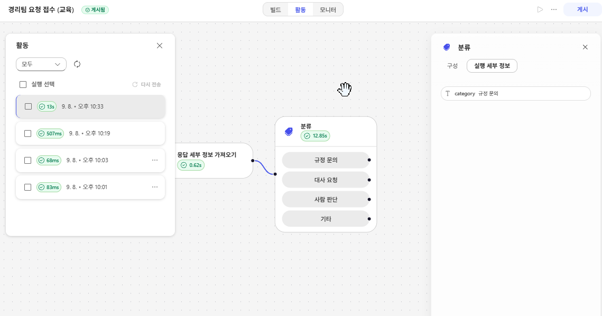
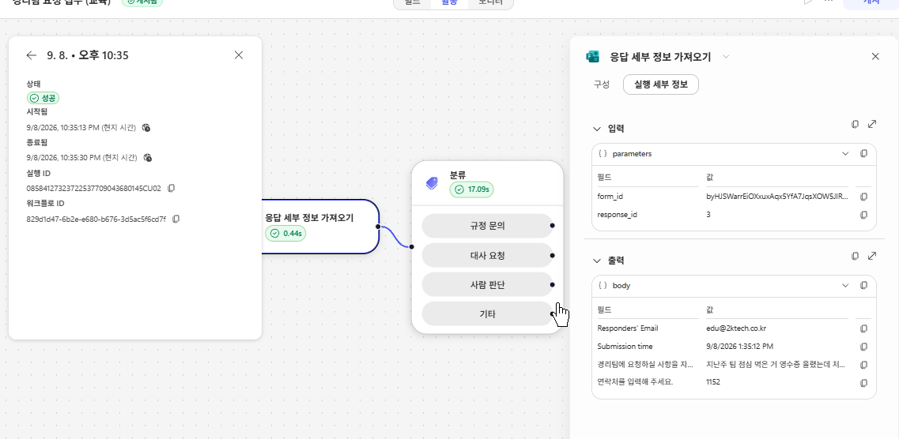

# Lab 4. Workflow 🔀

> **이번 랩 완성물**: 직원이 평문으로 쓴 요청을 받아 갈래를 가르고 각각 다른 곳으로 보내는 [Workflow](./glossary.html#workflow)
> **예상 시간**: 50분 · **완성 신호**: 비용과 무관한 글을 넣으면 Teams 메시지가 온다

{: .time }
50분 타이머.

<!-- 저작 메모(2026-09-02 개편): 설계 문서 §7 Lab 4 다.
     통으로 하나다. 8-27판도 통이었고 9-01 계획이 둘로 쪼갰다가 다시 합쳤다 —
     어제 직접 만들어 본 결과 연결 객체 문제가 CS 표준 하네스 교육을 거친 수강생에게
     걸림돌이 아니었다. 분류·에이전트·M365 Copilot·말단이 한 워크플로 위에 서야
     완성 신호가 하나로 잡힌다.
     통로를 Forms 로 잡은 것은 분류 때문이다 — 조건문이 볼 필드가 없는 평문이 들어와야
     분류를 쓸 이유가 생긴다. OneDrive 파일 투입은 8-27판의 통로였고 되돌림 경로로 남긴다.
     프로브 의존: 6a(게시된 에이전트만 목록에 뜬다) · 6d(분류 노드) · 6f(분류·M365 Copilot 용 연결) ·
     6h(Forms 트리거) · 7(Teams 발신 주체).
     ⚠️ 6f 가 관문이다. 분류가 안 되면 C단이 If/Else 로 내려가고 이 랩의 축이 사라진다.
        그 경우 D·E·F·G 는 그대로 서고 C단만 바뀐다.
     ⚠️ 강사 준비물 — Forms 양식은 미리 만들어 두고 수강생이 복제한다. 응답 예시는 §C에 인라인. -->

---

## 준비

Lab 3에서 **게시**를 마쳤어야 합니다. 게시하지 않은 에이전트는 워크플로의 목록에 뜨지 않습니다.

지금까지는 사람이 미리 보기 창을 열어 파일을 올렸습니다. 이 랩은 그 사람을 빼는 자리입니다.

---

## 단계

### A. 들어오는 통로를 만듭니다

1. Microsoft Forms를 엽니다. 강사가 안내한 양식을 **복제**합니다.

    

2. 양식을 엽니다. 문항이 **장문 텍스트 하나**뿐입니다.

    

3. 문항을 읽어 봅니다.

   ```
   경리팀에 요청할 내용을 자유롭게 적어 주세요.
   ```

    {: .important }
    **선택지가 없습니다.** 「비용 문의 / 정산 요청 / 기타」로 고르게 만들면 오늘 배울 것이 사라집니다. 사람은 양식을 골라 주지 않습니다.

4. 양식의 링크를 복사해 둡니다. C단 끝에서 씁니다.

### B. 워크플로를 만듭니다

{: start="5" }
5. Copilot Studio 왼쪽 메뉴 **워크플로**에서 **새 워크플로**를 선택합니다.

    

6. 종류를 고르는 화면이 나오면 **크레딧 사용** 뱃지가 붙은 쪽을 고릅니다.

    

    {: .note }
    같은 「워크플로」라도 과금이 구분됩니다. 오늘 쓰는 쪽은 크레딧이고, 클래식은 라이선스입니다.

7. 이름에 아래를 입력합니다.

   ```
   경리팀 요청 접수
   ```

8. 트리거로 **Forms — 새 응답이 제출되는 경우**를 고릅니다.

    

9. 양식 ID 목록에서 1번에서 복제한 양식을 고릅니다.

    

    {: .note }
    연결은 로그인한 계정으로 자동으로 붙습니다. 동의 화면이 뜨지 않습니다.

10. 응답 본문을 가져오는 동작을 추가합니다. 뒤 단계가 이 값을 씁니다.

     

11. **저장**합니다. 배너를 읽습니다. **게시해야 실행할 수 있습니다.**

     

     {: .important }
     저장과 게시가 다릅니다. 저장은 만들던 것을 남기는 것이고, **게시해야 트리거가 걸리고 실행됩니다.** 게시 전에는 실행 버튼도 눌리지 않습니다.

12. **게시**를 선택합니다. 상태 뱃지가 `Draft` 에서 `Published` 로 바뀝니다.

     

     {: .note }
     Lab 3에서 **에이전트**를 게시했습니다. 이것은 **워크플로** 게시입니다. 둘은 따로입니다.

13. 양식에 아무 글이나 하나 넣어 봅니다. 실행 기록이 남는지 확인합니다.

     

### C. 분류로 평문을 가릅니다

{: start="14" }
14. 다음 노드로 **분류**를 추가합니다.

     

15. 연결을 만들라고 하면 만듭니다. 동의 화면이 뜨면 승인합니다.

16. 분류할 대상으로 10번의 **응답 본문**을 지정합니다.

     

17. 갈래를 **넷**으로 늘립니다. 기본은 셋입니다.

     

18. 갈래마다 이름과 설명을 적습니다.

     | 갈래 | 설명에 적을 것 |
     |---|---|
     | `규정 문의` | 비용 처리 규정에 적힌 기준·한도·절차를 묻는다 |
     | `대사 요청` | 카드 명세와 증빙을 맞춰 보는 일이 필요하다 |
     | `사람 판단` | 금액이나 승인권자에 대한 판단이 필요하다 |
     | `해당 없음` | 비용 처리와 관계없다 |

     

19. **저장하고 다시 게시합니다.** 고친 것은 게시해야 반영됩니다.

20. 양식에 아래를 넣어 봅니다.

    ```
    자기계발비로 온라인 강의 하나 들었는데 얼마까지 되나요?
    ```

21. 실행 기록에서 어느 갈래로 갔는지 봅니다. `규정 문의` 입니다.

     

22. 이번에는 아래를 넣습니다.

    ```
    7월 카드값이랑 증빙이 안 맞는 것 같은데 한번 봐 주세요
    ```

23. `대사 요청` 으로 가는지 봅니다.

24. 두 문장을 나란히 놓고 봅니다.

    ```
    지난주 팀 점심 먹은 거 영수증 올렸는데 처리 되나요? 4명이었고 신입 환영 자리였어요
    대한제조 김과장님이랑 저녁 먹었습니다. 법인카드로 결제했고 12만원입니다
    ```

     {: .important }
     둘 다 「점심·저녁·영수증·법인카드」를 담고 있는데 갈래가 다릅니다. **조건문이 볼 필드가 없습니다.** 분류를 쓰는 이유가 여기 있습니다.

### D. 에이전트 노드로 대사를 넘깁니다

{: start="25" }
25. `대사 요청` 갈래에 **에이전트** 노드를 추가합니다.

     

26. 목록에서 **본인 이름이 붙은** `비용 처리 담당` 을 고릅니다. 같은 환경에 여러 사람의 것이 함께 보입니다.

     

     {: .note }
     목록에 없으면 Lab 3의 25번(게시)이 안 끝난 것입니다. **게시된 에이전트만 여기 올라옵니다.**

27. 에이전트에게 넘길 것을 지정합니다. 응답 본문과 요청자를 함께 넘깁니다.

     

28. 저장하고 다시 게시한 뒤, 22번의 문장을 다시 넣습니다.

29. 실행 기록을 열어 에이전트의 답이 돌아왔는지 봅니다.

     

30. 돌아온 내용을 읽습니다. Lab 1에서 미리 보기로 받던 것과 같은 종류입니다. **사람이 창을 열지 않았을 뿐입니다.**

### E. M365 Copilot 노드로 규정 문의를 받습니다

{: start="31" }
31. `규정 문의` 갈래에 **M365 Copilot** 노드를 추가합니다.

     

32. 연결을 만들라고 하면 만듭니다.

33. 물어볼 내용으로 응답 본문을 넘깁니다.

     

34. 저장하고 다시 게시한 뒤, 20번의 문장을 다시 넣습니다.

35. 답이 돌아오는지 봅니다.

     

     {: .important }
     **같은 워크플로 안에서 두 종류가 갈렸습니다.** 규정 문답은 사내 자료로 답하고, 대사는 우리가 만든 에이전트로 갑니다. 무엇을 어디로 보낼지가 설계입니다.

### F. 결과를 사람에게 보냅니다

{: start="36" }
36. `대사 요청` 갈래의 에이전트 노드 뒤에 **Teams 메시지 보내기**를 붙입니다.

     

37. 받는 사람을 요청자로 지정하고 본문에 에이전트의 답을 넣습니다.

     

38. `규정 문의` 갈래에도 같은 것을 붙입니다.

39. `사람 판단` 갈래에는 **담당자에게** 보냅니다. 여기는 자동으로 처리하지 않습니다.

     

40. 양식에 22번의 문장을 넣고 Teams에 실제로 도착하는지 봅니다.

     

<!-- 미확정 — 프로브 7 뒤에 확정한다
     Teams 메시지의 발신 주체가 사용자 이름인지 봇인지 미확인이다. 봇이면 37번 본문에
     「누가 보낸 것인가」를 한 줄 넣어야 받는 사람이 맥락을 안다.
     Outlook 은 후순위다 — E3 라 되기는 하나 실제로 안 쓰는 사람이 많아 도착 확인이 안 된다.
     ☐ 말단 후보로 Excel 행 쓰기를 더할지 검토 중. 처리 결과가 대장에 한 줄 남는 모양이라
       「자동화의 결과가 어디에 쌓이는가」를 보이기에는 Teams 보다 낫다.
       채택하면 39번 뒤에 3스텝을 더한다. -->

### G. 안 되는 것을 사람에게 돌립니다

{: start="41" }
41. `해당 없음` 갈래에 **Teams 메시지 보내기**를 추가합니다.

     

42. 본문에 아래를 그대로 입력합니다.

    ```
    비용 처리로 판단되지 않는 요청이 접수되었습니다.
    내용을 확인해 주세요.
    ```

43. 요청 본문을 함께 실어 보냅니다. 사람이 읽고 판단할 수 있어야 합니다.

44. 양식에 **비용과 관계없는 글**을 하나 넣습니다.

    ```
    사무실 형광등이 하나 나갔는데 어디에 말하면 되나요?
    ```

45. Teams에 메시지가 오는지 확인합니다.

     

     {: .important }
     **이것이 이 랩의 완성 신호입니다.** 갈래 셋이 도는 것보다 넷째 갈래가 사람에게 닿는 것이 중요합니다.

---

## 랩의 결론

**AI가 모든 것을 자동화해야 하는 것은 아닙니다.** 확실한 업무는 자동으로 처리하고 예외와 불확실과 잘못된 입력은 사람에게 돌립니다.

그 경계는 Workflow에 그립니다. Agent 안에 넣으면 「판단이 서지 않을 때 어떻게 하는가」가 모델의 그때그때 판단에 걸립니다.

### 오전에 배운 것과 무엇이 다른가

같은 회사 업무를 Copilot Studio 표준 하네스로도 만들어 봤습니다. 오늘 만든 것과 나란히 놓으면 이렇습니다.

| | 입문 · 중급 (표준 하네스) | 오늘 (GHCP 하네스) |
|---|---|---|
| 갈래를 어떻게 가르나 | 토픽과 조건 | **분류가 평문을 읽는다** |
| 처리 단위 | 대화 한 턴 | 파일 전체 |
| 연결 객체 | 같다 | 같다. 여기서 막히지 않는다 |
| 과금 | 라이선스 | **크레딧. 만들기 시작할 때부터** |

복리후생 문의를 받던 에이전트가 「7월 카드값이 안 맞는다」에 답하지 못한 것이 오늘의 출발점이었습니다. **그 요청이 갈 곳을 오늘 만들었습니다.**

---

## 확인

- [ ] 양식에 글을 넣으면 실행 기록이 남는다
- [ ] 같은 낱말을 담은 두 문장이 **다른 갈래**로 간다
- [ ] `대사 요청` 은 본인의 `비용 처리 담당` 의 답을 받아 온다
- [ ] `규정 문의` 는 사내 자료로 답한다
- [ ] 결과가 Teams로 도착한다
- [ ] 관계없는 글을 넣으면 **Teams 메시지가 온다**

[피날레로 →](./finale.html){: .btn .btn-purple }
