# Lab 4. Workflow 🔀

> **이번 랩 완성물**: 직원이 평문으로 쓴 요청을 받아 갈래를 가르고 각각 다른 곳으로 보내는 [Workflow](./glossary.html#workflow)
> **예상 시간**: 55분 · **완성 신호**: 비용과 무관한 글을 넣으면 Teams 메시지가 온다

{: .time }
55분 타이머.

<!-- 저작 메모(2026-09-02 개편): 설계 문서 §7 Lab 4 다.
     통으로 하나다. 8-27판도 통이었고 9-01 계획이 둘로 쪼갰다가 다시 합쳤다 —
     어제 직접 만들어 본 결과 연결 객체 문제가 CS 표준 하네스 교육을 거친 수강생에게
     걸림돌이 아니었다. 분류·에이전트·M365 Copilot·말단이 한 워크플로 위에 서야
     완성 신호가 하나로 잡힌다.
     통로를 Forms 로 잡은 것은 분류 때문이다 — 조건문이 볼 필드가 없는 평문이 들어와야
     분류를 쓸 이유가 생긴다. OneDrive 파일 투입은 8-27판의 통로였고 되돌림 경로로 남긴다.
     프로브 의존: 6a(게시된 에이전트만 목록에 뜬다 — 게시 절차는 2026-09-08에 Lab 3 에서 이 랩의 준비로 옮겼다) · 6d(분류 노드) · 6f(분류·M365 Copilot 용 연결) ·
     6h(Forms 트리거) · 7(Teams 발신 주체).
     ⚠️ 6f 가 관문이다. 분류가 안 되면 C단이 If/Else 로 내려가고 이 랩의 축이 사라진다.
        그 경우 D·E·F·G 는 그대로 서고 C단만 바뀐다.
     ⚠️ 2026-09-08: A단을 다시 세웠다. 강사가 만든 양식을 복제하는 방식을 버리고 Forms 의
        Copilot 으로 수강생이 직접 만든다. 문항을 손으로 짜지 않고 한 줄 프롬프트로 제안받는다.
        1~4번 촬영 완료. 강사 준비물에서 양식이 빠진다. 응답 예시는 §C에 인라인.
     ⚠️ 시험 실행이 크레딧을 쓴다. 분류 한 번이 12~17초다(2026-09-08 실측). 갈래마다 한 번이면
        충분하므로 같은 문장을 반복해 넣지 않는다. 25·26번은 촬영 없이 넘기고, 27·28번에서
        한 문장만 실제로 넣어 「같은 낱말인데 갈래가 다르다」를 본다.
     ⚠️ 트리거는 커넥터 유형에서 Forms 를 고르는 경로다. 「Forms — 새 응답이 제출되는 경우」가
        트리거 목록 최상위에 있는 것이 아니다. 실측으로 고쳤다(7·8번).
        이름 변경은 트리거를 잡은 뒤에 온다(9번).
     ⚠️ 그림 번호를 스텝 번호로 다시 매겼다(2026-09-08). 순번이 아니다. 한 스텝에 여러 장이면
        b · c 를 붙인다.
     2026-09-08: /tone 전문 검수 — 말투(비유·구어·의인화) 외에 띄어쓰기 오류와
                 비문, 절 제목 종결형 불일치를 함께 고쳤다. dialect.py 0건.
     -->

---

## 준비

워크플로의 에이전트 노드 목록에는 게시된 에이전트만 표시됩니다. 시작하기 전에 `비용 처리 담당 (본인 이름)` 을 게시합니다.

- 상단 **게시** 를 선택합니다.
- 대화상자에서 **Publish agent** 를 선택합니다.
- 상태가 `Published` 로 바뀔 때까지 창을 닫지 않습니다.

지금까지는 사람이 미리 보기 창을 열어 파일을 업로드했습니다. 이 랩에서는 그 과정을 없앱니다.

---

## 단계

### A. 요청을 받는 양식을 만듭니다

1. Microsoft Forms를 열고 **새 양식** 을 선택합니다.

    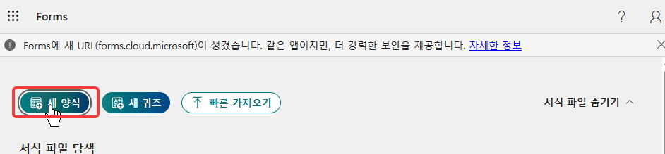

2. **Copilot으로 초안 작성** 입력창에 아래를 입력합니다.

    ```
    경리팀 요청사항 장문 텍스트와 연락처 수집 목적
    ```

    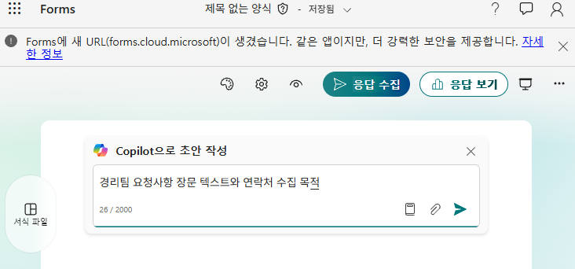

    {: .note }
    **양식을 받아서 쓰지 않습니다.** 문항을 손으로 만들지도 않습니다. 무엇을 받을 양식인지 한 줄로 적으면 Forms의 Copilot이 초안을 제안합니다.

3. 제안된 초안을 확인하고 **Copilot으로 계속하기** 를 선택합니다. 문항이 **둘**입니다.

    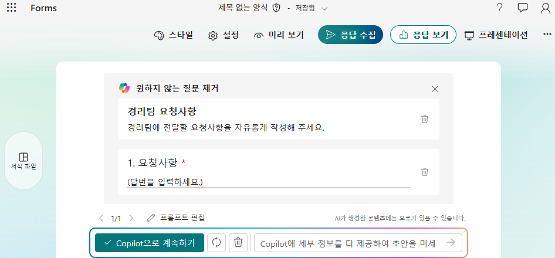

    {: .important }
    **요청사항 문항에 선택지가 없습니다.** 「비용 문의 / 정산 요청 / 기타」로 고르게 만들면 오늘 배울 것이 사라집니다. 실제 요청자는 갈래를 골라 주지 않습니다.

4. 제목을 바꿉니다. 괄호 안은 본인 이름입니다.

    ```
    경리팀 요청사항 및 연락처 수집 (홍길동)
    ```

    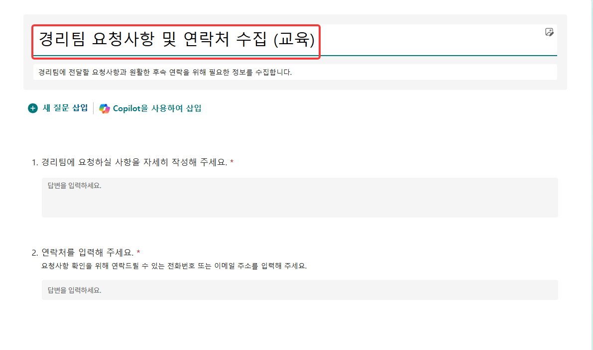

    {: .note }
    같은 환경에서 이름이 겹치면 8번의 양식 ID 목록에서 본인 것을 고르지 못합니다.

5. **설정** 을 열어 **이 양식을 작성할 수 있는 사람** 을 확인합니다.

    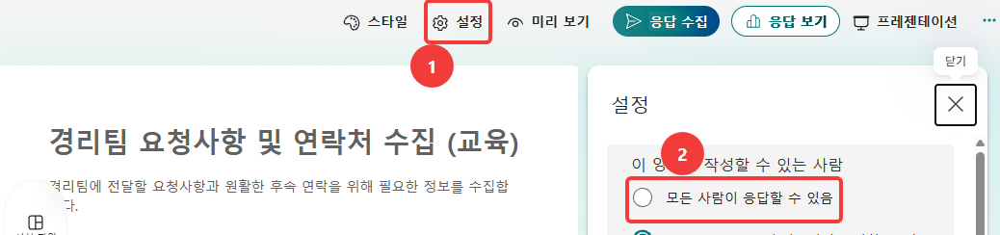

<!-- ☐ 미확정(2026-09-08) — 이 스텝을 「확인합니다」로 둘지 「모든 사람이 응답할 수 있음으로 바꿉니다」로
     둘지 정하지 않았다. 촬영본에서 「모든 사람이 응답할 수 있음」에 표시가 되어 있고 그 아래 항목이
     선택된 상태다. 다음 컷(미리 보기)에는 「이 양식을 제출하면 소유자에게 귀하의 이름과 이메일
     주소가 표시됩니다」가 나오는데, 이 문구는 조직 내 응답일 때 나온다. 둘이 어긋난다.
     -->

6. **미리 보기** 로 수강생이 볼 화면을 확인합니다.

    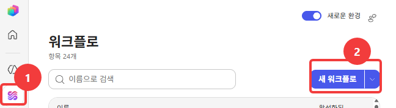

    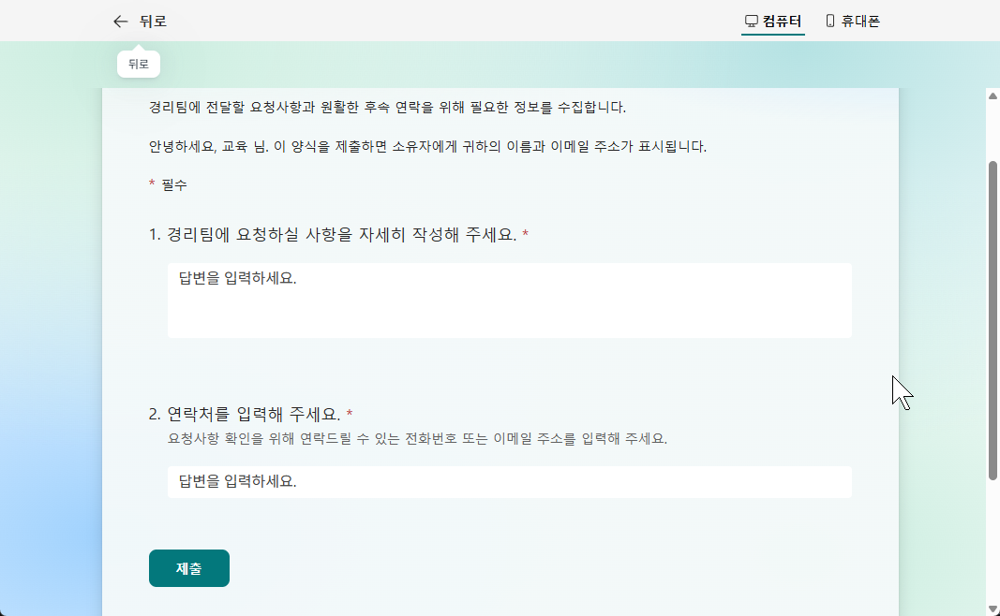

7. **응답 수집** 에서 양식 링크를 복사해 둡니다. C단 끝에서 씁니다.

    

### B. 워크플로를 만듭니다

{: start="8" }
8. Copilot Studio 왼쪽 메뉴 **워크플로** 에서 **새 워크플로** 를 선택합니다.

    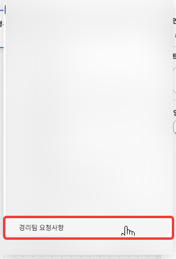

    {: .note }
    단추 오른쪽 화살표에서 종류를 고릅니다. 같은 「워크플로」라도 과금이 구분됩니다. 오늘 쓰는 쪽은 크레딧이고, 클래식은 라이선스입니다.

9. 캔버스의 **시작** 노드를 선택하고, 트리거 유형에서 **커넥터** 를 고릅니다.

    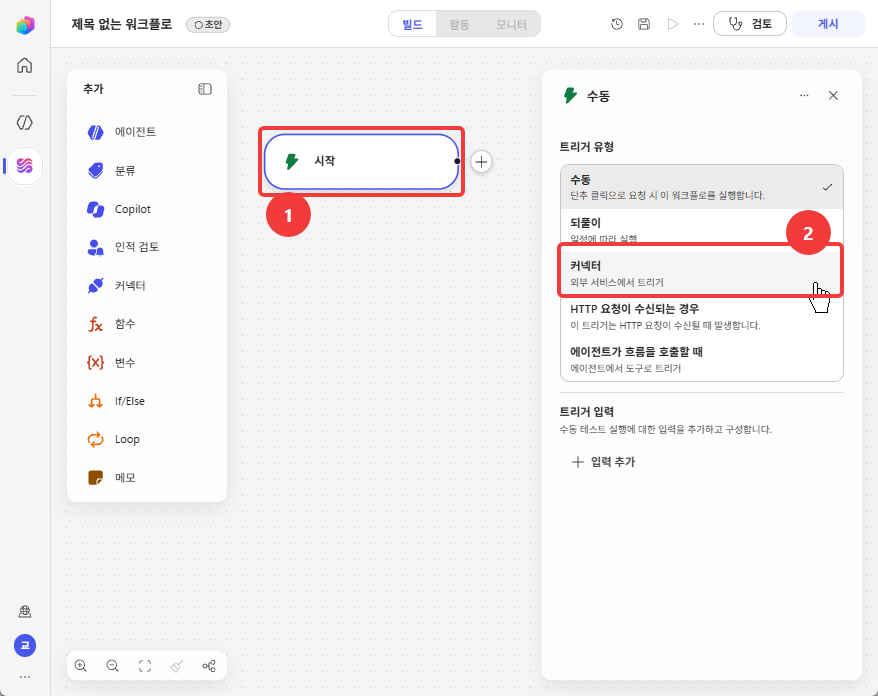

    {: .note }
    왼쪽 팔레트에 오늘 쓸 것이 다 있습니다. **에이전트 · 분류 · Copilot · 인적 검토 · 커넥터** 입니다.

10. **양식 ID** 목록에서 4번에서 만든 양식을 고릅니다.

     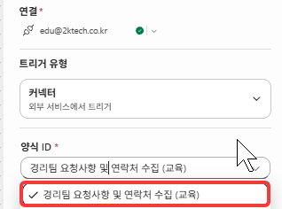

     {: .note }
     **연결** 은 로그인한 계정으로 자동 생성됩니다. 동의 화면이 뜨지 않습니다. 계정 옆에 초록 표시가 붙으면 연결된 것입니다.

     {: .warning }
     **양식 ID가 비어 있으면 트리거가 걸리지 않습니다.** 목록에서 고른 뒤 값이 남아 있는지 확인합니다.

11. 워크플로 이름을 아래로 바꿉니다. 괄호 안은 본인 이름입니다.

     ```
     경리팀 요청 접수 (홍길동)
     ```

     

12. **응답 세부 정보 가져오기** 노드를 붙입니다. 양식 ID는 같은 것을 고르고, 응답 ID는 트리거가 넘겨준 값을 씁니다.

     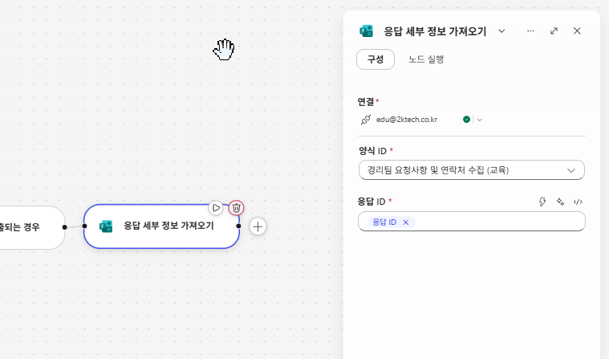

     {: .note }
     트리거는 **어느 응답인지**만 넘깁니다. 내용은 이 노드가 가져옵니다. 뒤 단계가 쓰는 값이 여기서 나옵니다.

13. **저장**하고 **게시**합니다. 상태 뱃지가 `초안` 에서 `게시됨` 으로 바뀝니다.

     

     {: .important }
     저장과 게시가 다릅니다. 저장은 만들던 것을 남기는 조작이고, **게시해야 트리거가 동작합니다.**

     {: .note }
     준비에서 게시한 것은 **에이전트** 입니다. 이것은 **워크플로** 게시입니다. 둘은 별개입니다.

14. **실행**(▷)을 누릅니다. **활동** 탭이 열리고 트리거 이벤트를 기다립니다.

     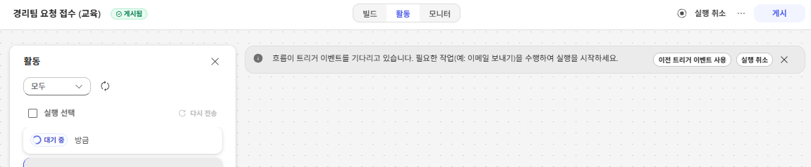

     {: .note }
     배너에 **이전 트리거 이벤트 사용** 이 있습니다. 새로 제출하지 않고 앞서 들어온 응답으로 다시 돌릴 때 씁니다.

15. 7번에서 복사한 링크로 양식에 응답을 하나 넣습니다. 실행이 **성공**으로 끝나고, 노드 출력에 응답 내용이 보입니다.

     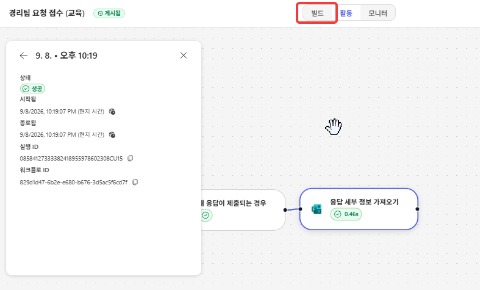

     {: .important }
     **여기까지가 통로입니다.** 사람이 워크플로를 열지 않았는데 양식 제출 하나로 실행이 시작되고 값이 들어왔습니다.

     {: .note }
     출력의 필드 이름은 **문항 문구 그대로** 입니다. 「경리팀에 요청하실 사항을 자세히 작성해 주세요」가 필드 이름이고, 그 값이 뒤 단계가 가를 평문입니다.

### C. 분류로 평문을 가릅니다

{: start="16" }
16. **빌드** 탭으로 돌아갑니다.

     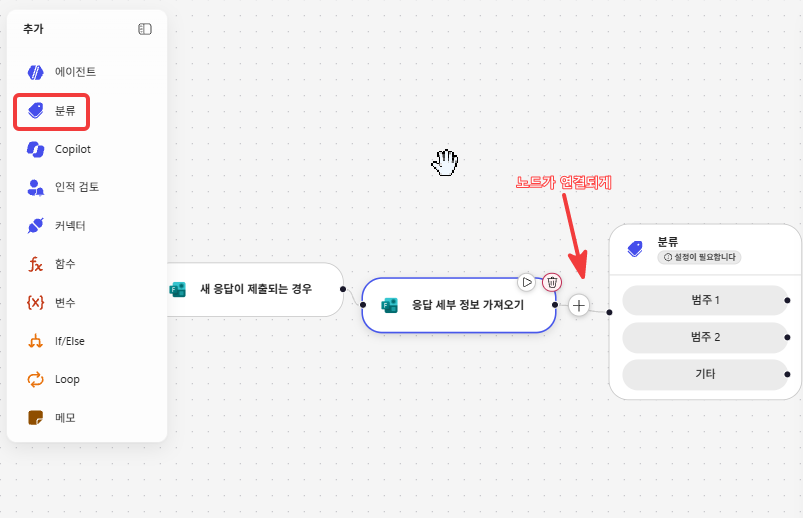

17. 왼쪽 팔레트에서 **분류** 를 골라 `응답 세부 정보 가져오기` 뒤의 `+` 에 붙입니다. 노드가 선으로 이어져야 합니다.

     

     {: .important }
     **범주는 둘로 시작합니다.** 「기타」가 함께 보여 셋처럼 읽히지만 직접 정하는 것은 둘입니다. 오늘은 하나를 더해 셋으로 씁니다.

18. 노드를 열어 구성 패널을 봅니다. **연결** 은 로그인한 계정으로 자동 생성됩니다.

     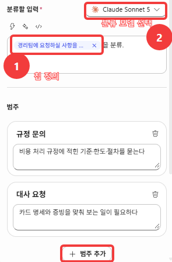

19. **분류할 입력** 에 12번이 가져온 요청사항 필드를 넣고, 오른쪽에서 **분류 모델** 을 고릅니다.

     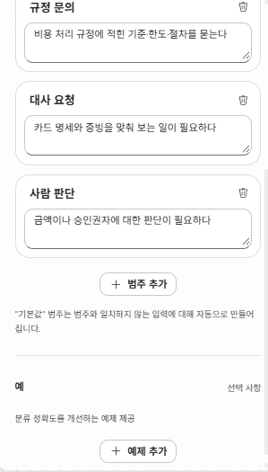

     {: .note }
     **분류에도 모델이 붙습니다.** 에이전트에만 있는 것이 아닙니다. 오늘은 `Claude Sonnet 5` 로 둡니다.

     {: .warning }
     **아래 20 · 21번에 넣을 한글은 메모장에 미리 적어 두고 붙여넣습니다.** 이 입력칸에서는 한글이 제대로 입력되지 않습니다.

20. **범주 추가** 로 하나를 더해 셋으로 만들고, 이름과 설명을 적습니다.

     | 범주 | 설명에 적을 것 |
     |---|---|
     | `규정 문의` | 비용 처리 규정에 적힌 기준·한도·절차를 묻는다 |
     | `대사 요청` | 카드 명세와 증빙을 맞춰 보는 일이 필요하다 |
     | `사람 판단` | 금액이나 승인권자에 대한 판단이 필요하다 |

     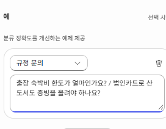

     {: .important }
     범주 아래에 이렇게 적혀 있습니다. **「기본값」 범주는 범주와 일치하지 않는 입력에 대해 자동으로 만들어집니다.** 비용 처리와 관계없는 요청을 받을 범주를 따로 만들지 않습니다.

21. **예** 에서 범주를 고르고 예제 문장을 넣습니다. 셋 다 넣습니다.

     | 범주 | 예제 |
     |---|---|
     | `규정 문의` | 출장 숙박비 한도가 얼마인가요? / 법인카드로 산 도서도 증빙을 올려야 하나요? |
     | `대사 요청` | 6월 카드 명세랑 증빙 대장 좀 맞춰 봐 주세요 / 증빙 누락 건이 있는지 확인 부탁드립니다 |
     | `사람 판단` | 이 건이 접대비인지 회식비인지 판단이 안 됩니다 / 승인권자가 팀장인지 본부장인지 확인이 필요합니다 |

     

     {: .note }
     화면에 **선택 사항** 이라고 적혀 있습니다. 설명만으로 갈리지 않을 때 이 문장들이 기준이 됩니다.

     {: .note }
     **뒤에서 넣어 볼 문장과 겹치지 않게 적었습니다.** 예제로 넣은 문장이 시험 문장과 같으면 갈래가 맞는지 확인할 수 없습니다.

22. **저장하고 다시 게시합니다.** 고친 것은 게시해야 반영됩니다.

23. 양식에 아래를 넣어 봅니다.

    ```
    자기계발비로 온라인 강의 하나 들었는데 얼마까지 되나요?
    ```

24. 실행 기록에서 어느 갈래로 갔는지 봅니다. `규정 문의` 입니다.

     

25. 이번에는 아래를 넣습니다.

    ```
    7월 카드값이랑 증빙이 안 맞는 것 같은데 한번 봐 주세요
    ```

26. `대사 요청` 으로 가는지 봅니다.

27. 아래 두 문장을 나란히 놓고, **첫 문장** 을 양식에 넣습니다.

    ```
    지난주 팀 점심 먹은 거 영수증 올렸는데 처리 되나요? 4명이었고 신입 환영 자리였어요
    대한제조 김과장님이랑 저녁 먹었습니다. 법인카드로 결제했고 12만원입니다
    ```

     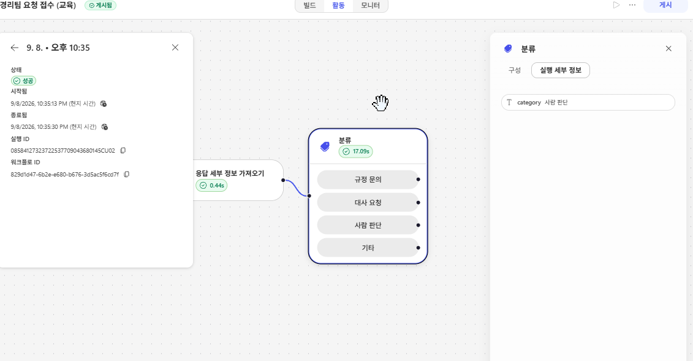

28. 분류 노드의 **실행 세부 정보** 를 봅니다. `사람 판단` 입니다.

     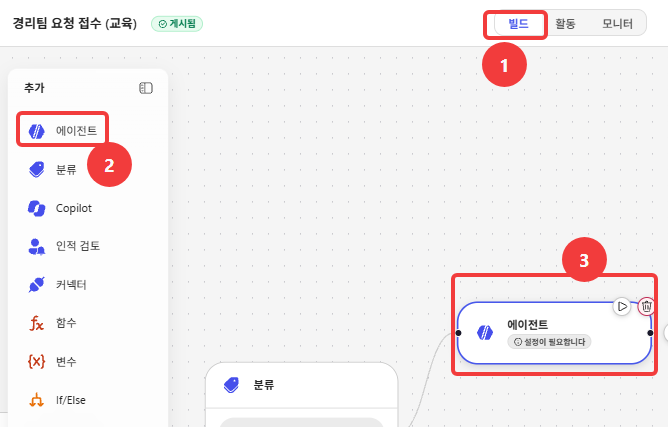

     {: .important }
     둘 다 「점심·저녁·영수증·법인카드」를 담고 있는데 갈래가 다릅니다. **조건문이 검사할 필드가 없습니다.** 분류를 쓰는 이유가 여기 있습니다.

### D. 에이전트 노드로 대사를 넘깁니다

{: start="29" }
29. **빌드** 탭에서 팔레트의 **에이전트** 를 `대사 요청` 갈래에 붙입니다.

     

30. 목록에서 **본인 이름이 붙은** `비용 처리 담당` 을 고릅니다. 같은 환경에 여러 사람의 것이 함께 보입니다.

     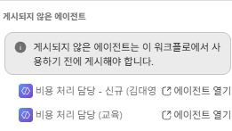

     {: .warning }
     **게시되지 않은 에이전트** 가 따로 묶여 있습니다. 화면에 이렇게 적혀 있습니다. 「게시되지 않은 에이전트는 이 워크플로에서 사용하기 전에 게시해야 합니다.」 준비의 게시가 끝나지 않았으면 여기서 막힙니다.

     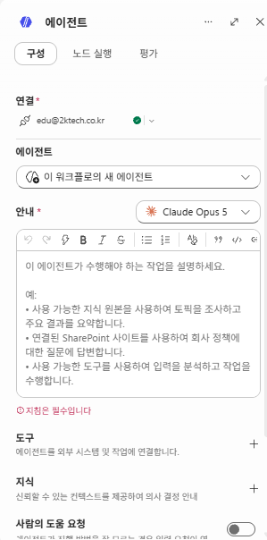

     {: .note }
     **미리 만들어 둔 에이전트가 없으면 여기서 새로 정의할 수 있습니다.** 에이전트 칸에서 「이 워크플로의 새 에이전트」를 고르면 모델과 지침을 그 자리에서 적습니다. 지침은 필수입니다. 오늘은 앞에서 만든 것을 그대로 씁니다.

31. 에이전트에게 넘길 것을 지정합니다. 응답 본문과 요청자를 함께 넘깁니다.

     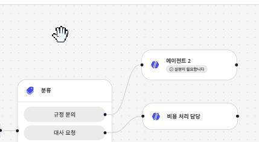

32. 저장하고 다시 게시한 뒤, 25번의 문장을 다시 넣습니다.

33. 실행 기록을 열어 에이전트의 답이 돌아왔는지 봅니다.

     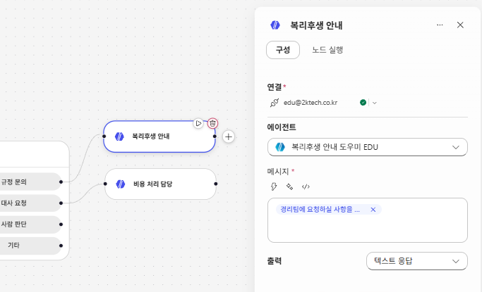

34. 돌아온 내용을 읽습니다. Lab 1 에서 미리 보기로 받던 것과 같습니다. **사람이 창을 열지 않았는데도 같은 결과가 나옵니다.**

### E. M365 Copilot 노드로 규정 문의를 받습니다

{: start="35" }
35. `규정 문의` 갈래에 **M365 Copilot** 노드를 추가합니다.

     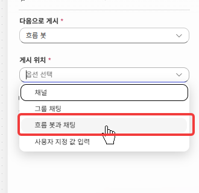

36. 연결을 만들라고 하면 만듭니다.

37. 물어볼 내용으로 응답 본문을 넘깁니다.

     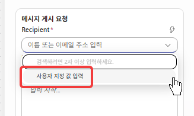

38. 저장하고 다시 게시한 뒤, 23번의 문장을 다시 넣습니다.

39. 답이 돌아오는지 봅니다.

     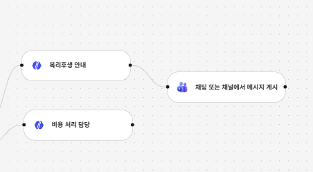

     {: .important }
     **같은 워크플로 안에서 두 종류가 갈렸습니다.** 규정 문답은 사내 자료로 답하고, 대사는 우리가 만든 에이전트로 갑니다. 무엇을 어디로 보낼지가 설계입니다.

### F. 결과를 사람에게 보냅니다

{: start="40" }
40. `대사 요청` 갈래의 에이전트 노드 뒤에 **Teams 메시지 보내기**를 붙입니다.

     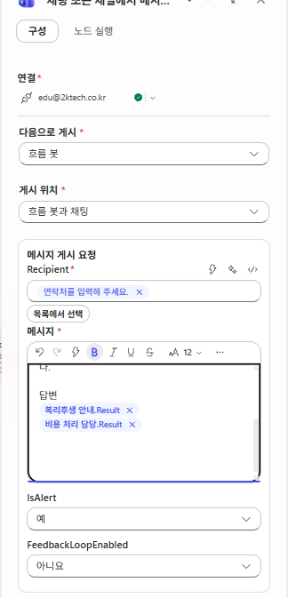

41. 받는 사람을 요청자로 지정하고 본문에 에이전트의 답을 넣습니다.

     

42. `규정 문의` 갈래에도 같은 것을 붙입니다.

43. `사람 판단` 갈래에는 **담당자에게** 보냅니다. 여기는 자동으로 처리하지 않습니다.

     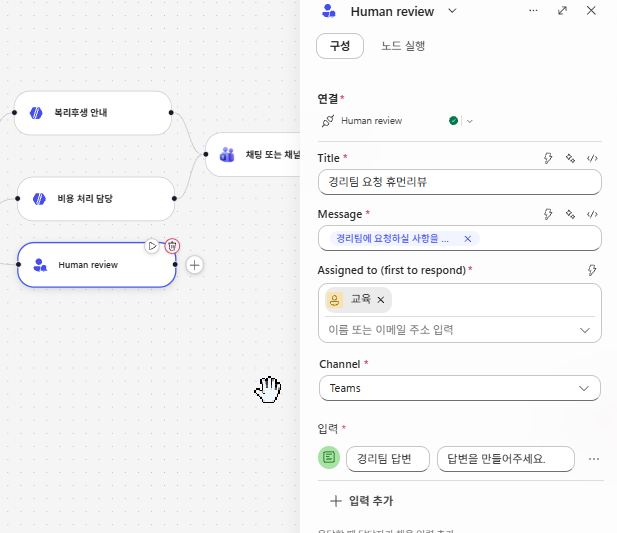

44. 양식에 25번의 문장을 넣고 Teams에 실제로 도착하는지 봅니다.

     

<!-- 미확정 — 프로브 7 뒤에 확정한다
     Teams 메시지의 발신 주체가 사용자 이름인지 봇인지 미확인이다. 봇이면 37번 본문에
     「누가 보낸 것인가」를 한 줄 넣어야 받는 사람이 맥락을 안다.
     Outlook 은 후순위다 — E3 라 되기는 하나 실제로 안 쓰는 사람이 많아 도착 확인이 안 된다.
     ☐ 말단 후보로 Excel 행 쓰기를 더할지 검토 중. 처리 결과가 대장에 한 줄 남는 모양이라
       「자동화의 결과가 어디에 쌓이는가」를 보이기에는 Teams 보다 낫다.
       채택하면 39번 뒤에 3스텝을 더한다. -->

### G. 처리하지 않을 요청을 사람에게 돌립니다

{: start="45" }
45. **기타** 갈래에 **Teams 메시지 보내기**를 추가합니다.

     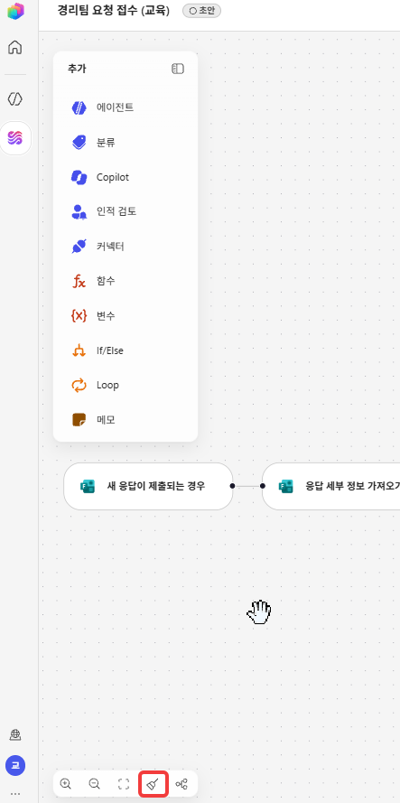

46. 본문에 아래를 그대로 입력합니다.

    ```
    비용 처리로 판단되지 않는 요청이 접수되었습니다.
    내용을 확인해 주세요.
    ```

47. 요청 본문을 함께 실어 보냅니다. 사람이 읽고 판단할 수 있어야 합니다.

48. 양식에 **비용과 관계없는 글**을 하나 넣습니다.

    ```
    사무실 형광등이 하나 나갔는데 어디에 말하면 되나요?
    ```

49. Teams에 메시지가 오는지 확인합니다.

     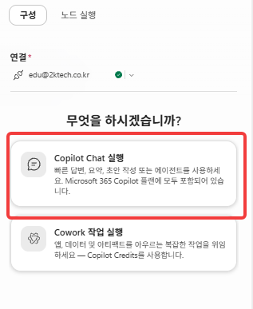

     {: .important }
     **이것이 이 랩의 완성 신호입니다.** 갈래 셋이 동작하는 것보다 넷째 갈래가 사람에게 전달되는 것이 중요합니다.

---

## 랩의 결론

**AI가 모든 것을 자동화해야 하는 것은 아닙니다.** 확실한 업무는 자동으로 처리하고, 예외·불확실한 판단·잘못된 입력은 사람에게 돌립니다.

그 경계는 Workflow 에서 정합니다. Agent 안에 넣으면 「판단이 서지 않을 때 어떻게 하는가」를 모델이 매번 다르게 정합니다.

### 입문·중급과 무엇이 다른가

같은 회사 업무를 Copilot Studio 표준 하네스로도 만들어 봤습니다. 오늘 만든 것과 나란히 놓으면 이렇습니다.

| | 입문 · 중급 (표준 하네스) | 오늘 (GHCP 하네스) |
|---|---|---|
| 갈래를 어떻게 가르나 | 토픽과 조건 | **분류가 평문을 읽는다** |
| 처리 단위 | 대화 한 턴 | 파일 전체 |
| 연결 객체 | 같다 | 같다 |
| 과금 | 라이선스 | **크레딧. 만들기 시작할 때부터** |

복리후생 문의를 받던 에이전트가 「7월 카드값이 안 맞는다」에 답하지 못한 상황에서 오늘을 시작했습니다. **그 요청이 갈 곳을 오늘 만들었습니다.**

---

## 확인

- [ ] 양식에 글을 넣으면 실행 기록이 남는다
- [ ] 같은 낱말을 담은 두 문장이 **다른 갈래**로 간다
- [ ] `대사 요청` 은 본인의 `비용 처리 담당` 의 답을 받아 온다
- [ ] `규정 문의` 는 사내 자료로 답한다
- [ ] 결과가 Teams로 도착한다
- [ ] 관계없는 글을 넣으면 **Teams 메시지가 온다**
