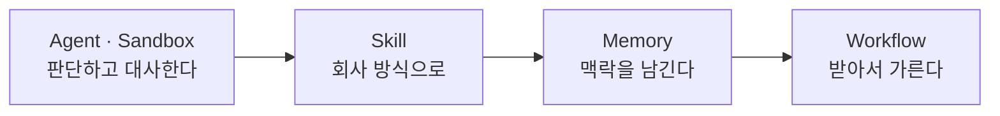

# GHCP 하네스 Lab 🧾

**"두 개의 파일로 완료된 월말 정산."**

<!-- 저작 메모(2026-09-02 개편): 랩 넷 확정에 맞춰 이 페이지를 다시 맞췄다.
     분 배정은 설계 문서 §2가 확정본이다. 여기 표를 §2 표와 어긋나게 두지 않는다.
     2026-09-08: /tone 검수 — 「자리」·의인화·대구를 걷어냈다.
                 검출은 ~/.claude/skills/tone/dialect.py 가 한다.
     2026-09-08: /tone 전문 검수 — 말투(비유·구어·의인화) 외에 띄어쓰기 오류와
                 비문, 절 제목 종결형 불일치를 함께 고쳤다. dialect.py 0건.
     -->

법인카드 명세 1,000행과 증빙 대장 997행을 대조합니다. 행 수가 다르니 어딘가 어긋나 있습니다. 어긋난 것을 찾아 목록으로 만들고, 일치하는 것은 처리 문서로 만듭니다. 이 한 가지 업무를 구현하면서 하네스의 여섯 부품을 다룹니다.

**복리후생 문의를 받던 에이전트가 답하지 못한 상황**에서 시작합니다. 규정을 읽고 문답하는 것과 파일 두 개를 열어 맞춰 보는 것은 다른 일입니다.

{: .note }
이 사이트는 **3시간 과정**을 목적으로 합니다. Lab 1~4로 한 세션이 구성됩니다.

---

## 오늘 쓰는 것

**[GitHub Copilot 하네스](./docs/glossary.html#ghcp-harness)** 위에서 만듭니다. [하네스](./docs/glossary.html#harness)는 Copilot Studio에서 만든 것을 실제로 돌리는 런타임입니다. 무엇을 만들든 그 아래에 하네스가 하나 깔립니다. 셋 중 무엇을 골랐느냐에 따라 쓸 수 있는 부품과 과금이 구분됩니다.

### 셋을 한 줄로

| 하네스 | 한 줄 |
|---|---|
| [Copilot 채팅 하네스](./docs/glossary.html#chat-harness) | 아는 것을 찾아서 답한다 |
| [표준 하네스](./docs/glossary.html#standard-harness) | 만든 사람이 경로를 설계한다 |
| [GitHub Copilot 하네스](./docs/glossary.html#ghcp-harness) | Agent가 경로를 스스로 정한다 |

### 무엇이 갈리나

| | Copilot 채팅 | 표준 | GitHub Copilot |
|---|---|---|---|
| 맡는 업무 | 사내 자료 질의응답 | 규칙 기반 정형 업무 | 다단계 추론 · 분석 · 파일 생성 |
| 경로를 누가 정하나 | 사용자 질문 | 설계자 | [Agent](./docs/glossary.html#agent) |
| 실행 | 질문 → 검색 → 답변 | 정해 둔 순서대로 | 판단 → 실행 → 관찰을 반복 |
| 도구 | M365 검색 중심 | 설계한 액션 호출 | 상황에 따라 고르고 이어 붙인다 |
| 파일 생성 | 제한적 | 주 목적이 아니다 | Word · Excel · PowerPoint · PDF |
| [Skill](./docs/glossary.html#skill) · [Memory](./docs/glossary.html#memory) | 없다 | 없다 | 있다 |
| 게시 범위 | 사내 | 사내 · 사외 | 사내 · 사외 |
| 과금 | 라이선스 포함 또는 사용량 | 라이선스 | [Copilot Credits](./docs/glossary.html#copilot-credits) |
| 대표 | M365 Copilot Chat 확장 | 기존 Copilot Studio 에이전트 | 오늘의 `비용 처리 담당` |

{: .important }
**하네스는 만들 때 고릅니다.** 표준과 GitHub Copilot은 서로 직접 변환되지 않습니다. 옮기려면 다시 만듭니다.

[표준 하네스](./docs/glossary.html#standard-harness)와 달리 GitHub Copilot 하네스에는 [토픽](./docs/glossary.html#topic)이 없습니다. 길을 미리 그려 두지 않고, [Agent](./docs/glossary.html#agent)가 자료를 보고 무슨 일인지 판단합니다. 표의 「경로를 누가 정하나」 한 줄이 랩마다 다시 나오는 질문입니다.

### 세 트랙 중 오늘은 어디인가

| 과정 | 하네스 | 다루는 것 |
|---|---|---|
| 입문 · 중급 | 표준 | [Knowledge](./docs/glossary.html#knowledge) · [토픽](./docs/glossary.html#topic) · 플로 · 커넥터 |
| 오늘 | GitHub Copilot | [Skill](./docs/glossary.html#skill) · [Memory](./docs/glossary.html#memory) · [Sandbox](./docs/glossary.html#sandbox) · 연결된 에이전트 · [Workflow](./docs/glossary.html#workflow) |

세 트랙이 이 순서로 이어집니다 — 아는 것을 답한다, 상태를 바꾼다, 업무를 끝까지 수행한다. 오늘이 세 번째입니다.

Copilot 채팅 하네스로는 오늘 아무것도 만들지 않습니다. 다만 [Lab 4](./docs/lab4.html)에서 M365 Copilot 노드를 붙일 때 그 화면을 한 번 거칩니다.

<!-- 촬영: Add knowledge 대화상자 또는 하네스 선택 화면. 프로브 뒤에 찍는다 -->

---

## 세 시간의 흐름

**Lab 1과 Lab 2가 중요합니다.** Lab 1에서 결과가 나오되 양식이 제각각인 것을 보고, Lab 2에서 통일된 양식으로 제작합니다.

---

## 과정 구성

각 랩은 **타이머**로 페이스를 맞추며 진행합니다.

| | 분 | 내용 |
|---|---|---|
| [시작 전에](./docs/before-you-start.html) | 10 | 환경 확인 · 재료 내려받기 |
| [Lab 1. 판단하는 Agent](./docs/lab1.html) | 40 | Agent · [Knowledge](./docs/glossary.html#knowledge) · 실행 환경 · **1,000행 대사** |
| [Lab 2. Skill](./docs/lab2.html) | 30 | 내장 스킬 · 커스텀 스킬 · 표준 양식 문서 |
| [Lab 3. Memory](./docs/lab3.html) | 20 | [Memory](./docs/glossary.html#memory) · 기억이 쌓이는 모양 · 추론 읽기 |
| [Lab 4. Workflow](./docs/lab4.html) | 55 | 게시 · 분류 · Agent 노드 · M365 Copilot · Teams |

용어는 [용어집](./docs/glossary.html)에 처음 등장 순서대로 정리해 두었습니다.

---

**고정 지식과 사용자별 설정은 따로 둔다**
[Knowledge](./docs/glossary.html#knowledge)에는 에이전트가 늘 갖고 있어야 하는 고정 지식이 들어갑니다. 회사의 규정이 여기입니다. 「프로젝트 비용에는 프로젝트 코드가 필요하다」(규정 §6.2)가 그것입니다. [Memory](./docs/glossary.html#memory)에는 사용자별로 구분되는 설정이 남습니다. 「이 사람은 결과를 표가 아니라 사람별 목록으로 받는다」가 이쪽입니다. 가르는 기준은 다른 사람이 물어도 같은 답이 나와야 하는가입니다. Lab 3에서 뒤쪽을 직접 남겨 봅니다.

<!-- 저작 메모(2026-09-07 실측): Memory 예시를 「프로젝트 코드를 먼저 확인받는다」에서 바꿨다.
     그 문장을 Lab 3 에서 실제로 넣어 봤더니 규정 문답으로 처리되고 Saved memories 는
     비어 있었다. 규정 §6.2에 같은 내용이 있다.
     ⚠️ 한 번 해 본 것이고, 무엇 때문에 그렇게 갔는지는 가르지 못했다. 문장을 바꿀 때
        겹침·주어·「기억해줘」 셋이 한꺼번에 바뀌었다. 어느 하나가 결정적이라고 적지 않는다.
        라우팅은 매번 같게 나오지 않는다 — 규칙처럼 쓰지 말 것. -->

**행의 개수를 세는 것과 회계적 대사는 다르다**
명세와 대장의 행 수 차이는 3입니다. 다만 어긋난 데이터가 3건이라는 뜻은 아닙니다.

<!-- 미확정 — 어긋난 데이터의 건수를 숫자로 못 박지 않았다. 면제 3 · 누락 1 · 중복 1 · 금액 1 을
     어디까지 세느냐에 따라 5 도 6 도 된다. 에이전트를 만들어 실제로 돌려 본 뒤 확정한다.
     확정되면 여기와 _instructions/재료_설계와_정답.md §4 를 같은 숫자로 맞춘다. -->

**실행 환경을 바꾸면 처리할 수 있는 양이 달라진다**
[Sandbox](./docs/glossary.html#sandbox)는 파일 자체를 열어 전체를 읽습니다. 그만큼 [Copilot Credits](./docs/glossary.html#copilot-credits)를 씁니다. 다만 읽는 행이 늘어난 만큼 사용량이 늘지는 않습니다.

**자동화하지 않을 범위를 정하는 것도 설계다**
Lab 4에서 비용 처리와 무관한 요청을 사람에게 돌리는 경로를 직접 만듭니다. 사람이 확인하는 경로를 남겨 두면 자동화가 더 안정적으로 동작합니다.

---

{: .note }
등장하는 회사·직원·금액·규정은 모두 가상 설정(한별소프트)입니다. 실제 카드 명세나 영수증을 업로드하지 마세요.

---

[시작 전 확인부터 →](./docs/before-you-start.html){: .btn .btn-purple }
